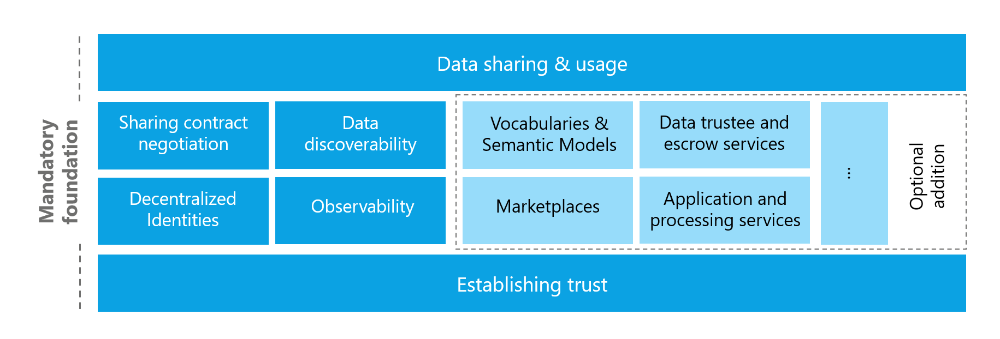

# Foundational concepts of a data space

The mandatory foundational concepts and functional areas of a data space are:

- **Establishing trust:** Defining the procedures, evidence categories, and decision rules that enable participants to evaluate the suitability of counterparties.

- **Data sharing and usage:** Specifying the permitted data flows, processing activities, and contractual obligations that govern how data may be used after it is shared.

- **Data discoverability:** Providing metadata and discovery mechanisms that enable participants to find and assess available data assets and services.

- **Sharing contract negotiation:** Establishing the processes and protocols—ranging from automated negotiation to manual escalation—used to reach mutually acceptable contract terms and policy alignments.

- **Decentralized identities:** Implementing DIDs and verifiable credentials to represent participants and assert attributes in a verifiable and privacy-preserving manner.

- **Observability:** Ensuring auditability and runtime monitoring capabilities to detect violations, gather evidence for disputes, and support continuous trust evaluation.

Additional value-adding services that support these main functions of a data space may include the following optional functional areas:

- **Vocabularies and semantic models:** Curated ontologies and schema registries that improve interoperability and precise meaning of data shared across participants.

- **Application and processing services:** Hosted or on-demand processing capabilities (for example, analytics, enrichment pipelines, or confined compute) that offer contract negotiations for API endpoints and enforceable usage policies.

- **Marketplaces:** Commercial catalogues and negotiation platforms that facilitate discovery, pricing, and contractual arrangements for data products and services while respecting governance and access policies.

- **Data trustees and escrow services:** Neutral service providers that hold, mediate, or process data under predefined governance constraints (for example, confined compute or escrowed storage) to enable joint analysis while preserving confidentiality.

- **Other optional value-added services:** Additional capabilities such as notary, or auditing services, and specialized domain-specific tooling which may be selected to meet particular participant requirements.

