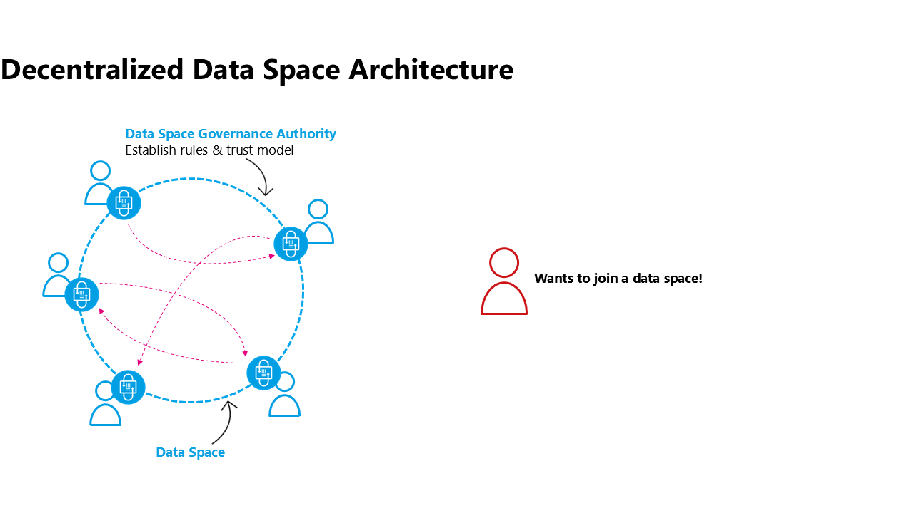
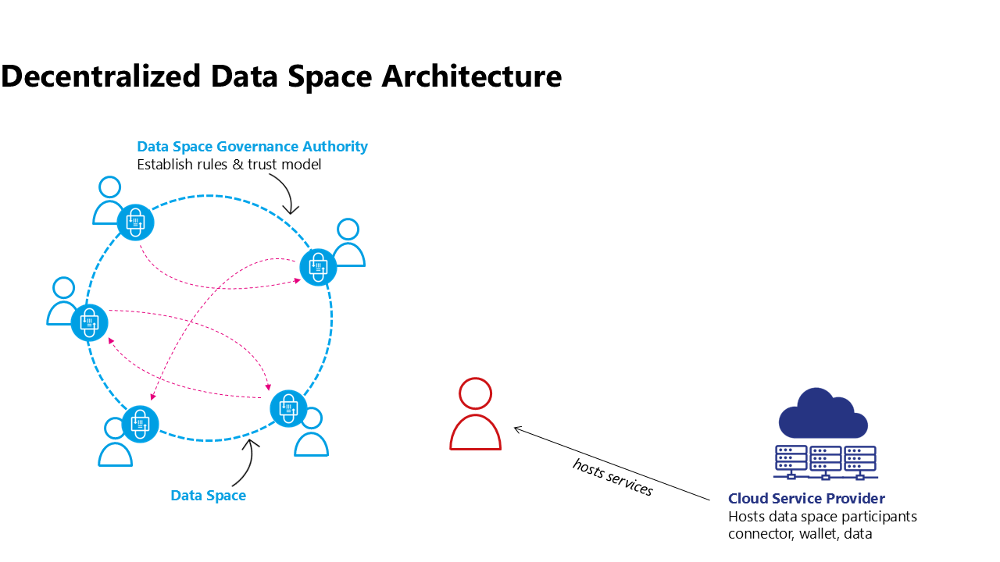
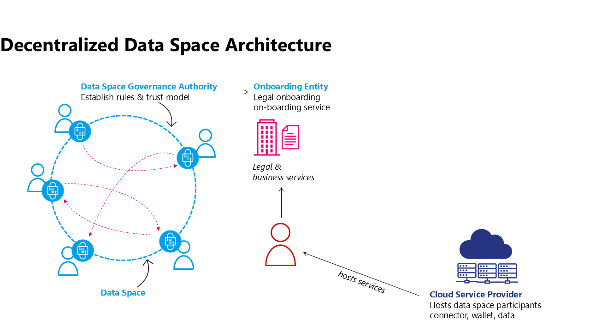
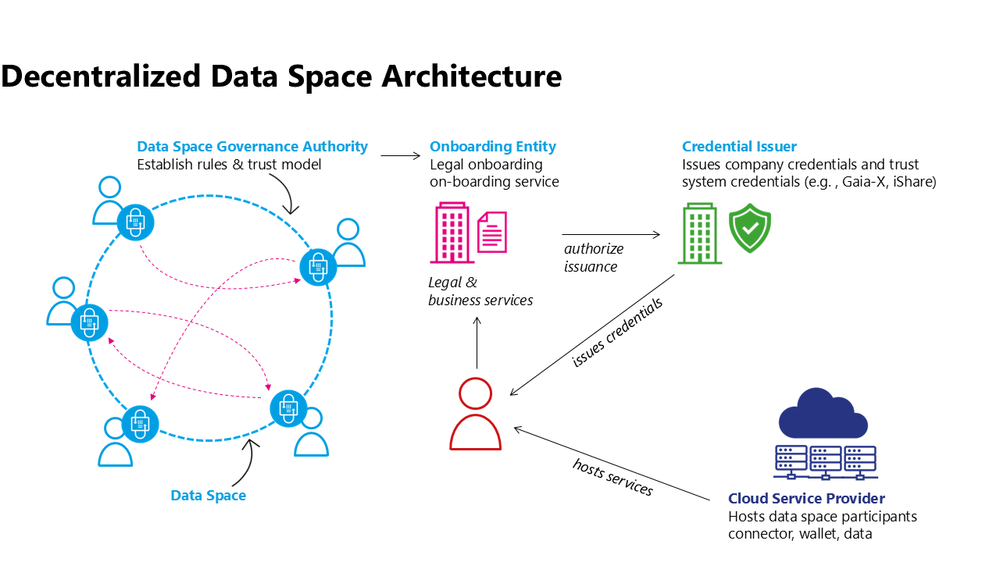
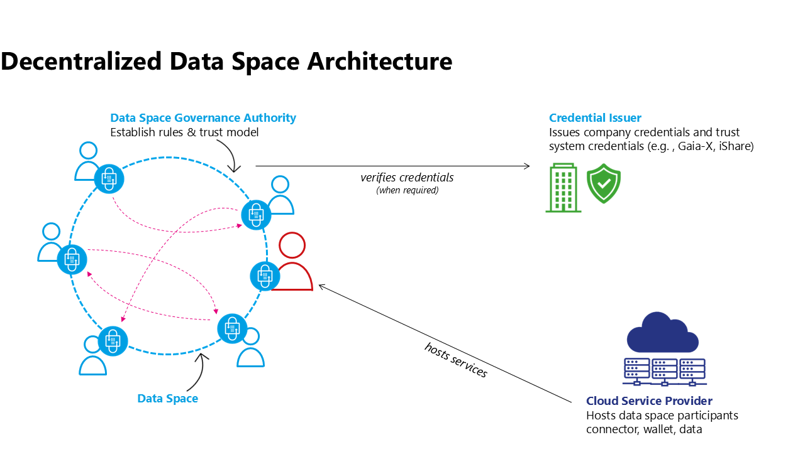

# Onboarding Pattern for Decentralized Data spaces
## Joining a data space
Decentralized data space architecture emphasizes the autonomy and agency of participants, thus it must be a voluntary decision of a participant to join a data space. 
 

## Selecting a hosting model and provider
However, with great power also comes great responsibility, so the participant has some work to do. It’s not like joining a centralized platform, where one creates an account and that’s it. The participant needs to actively make a decision on where to operate the technology that’s needed to be active in a data space: The data space connector, the wallet, data staging areas, etc… Although this seems to be a complex and difficult task to accomplish it is ultimately what enables digital sovereignty. Every participant can operate on the infrastructure of their choice and they can make an autonomous decision on how much agency to have. Any operating model available - from on premises to  classical cloud computing is also possible for data space technologies: starting at a fully customized hosting model on one end of the spectrum, a platform as a service model for connectors and wallets, all the way to fully managed use case services (e.g. a data intermediary offering a Digital Product Passport service including sharing capabilities to a manufacturing data space) on the other side of the spectrum. Further, such components might be operated for an individual data space or reusable for a multitude of data spaces by leveraging dynamic contexts and configuration capabilities.

## Onboarding to a data space
Once the future participant has all technical components up and running they need to understand the rules and processes of the data space, maybe sign some legal contracts of the data space organization, provide evidence on their claims that they satisfy the rules of the data space and many other steps needed to be onboarded to the data space. This can be done by an onboarding service provided by the organization representing the community of the data space (e.g. a not for profit organization, a government entity responsible for a regulatory data space, or a commercial entity leading a data space created around their organization and its partners). This onboarding service is needed only as a one-time access point while joining the data space. It might have an additional service like notifying existing members that a new member is joining, but usually will not be needed for the ongoing operation of the data space. 

It is important to understand that in a decentralized architecture, no ongoing dependency on a central or federated services should be mandated. As this example illustrates on popular mechanism to realize a decentralized architecture there are other solution paths as well.
 

If the data space relies on an onboarding entity to manage the onboarding process this entity can ensure the adherance to membership rules and potential additional steps like checking the validity of external DTF credentials.

If there is no onboarding entity a new participant could simply prove their eligibility to be a member of the data space by providing claims to another participant who accepts the membership after evaluating all membership rules and the claims provided.

There are many other models of how membership of a data space can be established. For further process steps in this article the focus will be on the scenario of an Onboarding Entity working with an external credential issuer.

Often the Onboarding Entity can directly issue membership credentials for the new participant, however, in this scenario it requires additional steps from external actors, the Credential Issuers from a DTF which are being used within the data space.

## Obtaining Credentials from external data space Trust Frameworks
In complex, large-scale data spaces  a data space Governance Authority will not define every single rule of the data space but rely on existing data space Trust Frameworks to provide building blocks from which to construct the DSGAs rules for this specific data space. E.g. Gaia-X could be leveraged to provide labeling for the infrastructure providers used by individual participants, iSHARE could be supporting the legal onboarding of participants. In those cases the Onboarding Service will need to collaborate with the onboarding/issuing services of the various DTFs. However, the ultimate responsibility of maintaining credentials about their claims is with the participant. So although the Onboarding Service of the data space might collaborate with the Issuance Service of the DTF the DTF credential has to be issued directly to the data space participant. Alternatively the credential issuance can also be requested by the participant.

This process might have to be repeated for every credential issuer that is being used within the data space. It might also be possible that the participant already holds a credential from accepted external DTF credential issuers due to their membership in another data space. It is possible that this are accepted by the data space. 

Once issued the data space participant can use this credential together with the membership credentials from the data space Onboarding Service to provide evidence of its claims when negotiating a sharing contract with other participants of the data space.

It is important to note that many variations of this process can exist and it is part of the role of the DSGA to define the exact business process which leads to the set of credentials that are then resulting in a membership credential for the data space in question. This process can be influenced by business needs, regulation, and other external factors.
 

## Using credentials in the data space
When two participants of a data space interact it will be necessary to match policy constraints of one party to the claims that the other party presents. In most cases it will be sufficient to verify the signature of the credential issuer and the expiration date as the claim is presented by the participant. After all cryptographical methods will enable the other party to verify that the presented credential is representing the counterparty and has been signed by the credential issuer. However, in more complex cases it might be necessary to check the validity of a signature synchronously with the Credential Issuer. One such example can be the necessity of near real-time checks of the revocation of a credential.
 

