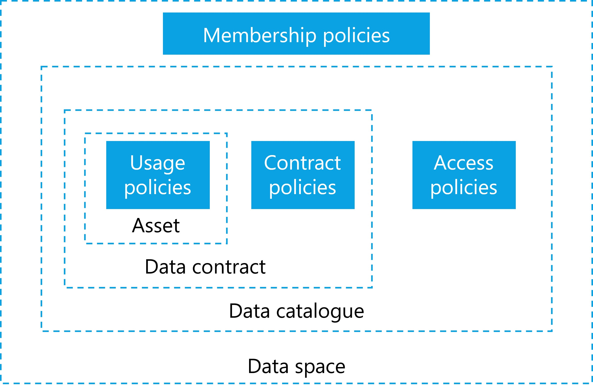

# Policies

Policies are the rules by which trust boundaries are established within a data space. They are used at multiple levels and at almost every interaction point. The main policy groups that are central to the functionality of a data space
are access policies (which control access to something) and contract
policies (which control specific terms of a contract). While
the use of policies can be expanded by custom design within a data space
there are several fundamental policy points that enable the operation
and are therefore essential to understand.

It is essential to use policies for attribute-based trust in a data
space. Which policies need to be mandatory depends on the design and the
requirements. One data space might require policies that reflect the
sensitivity of health data in an international setting, while another
data space will need to enforce policies for national energy regulation.

Ultimately, the sum of all policies (data space, participant, asset) form the trust context on a specific data sharing contract governing the access and the use of a specific asset.

Therefore, data spaces and participants must define their own policies and communicate them clearly. Participants may always choose additional policies in
their data contracts to further restrict access and use.

Dataspace Trust Frameworks (DTFs) can provide policy building blocks to simplify the design and selection of effective policies to reach the desired trust level.

## Policy Design

Policies generally express three classes of constraints used to control interactions:

- **Prohibitions:** Explicit assertions of forbidden actions (for example, "data may not be exported outside the EEA"), which must be enforced and may be paired with monitoring and sanctions.

- **Obligations:** Required actions or checks that a participant must perform (for example, logging, periodic revalidation, or notification), often with accompanying deadlines and verifiable evidence.

- **Permissions:** Explicitly allowed actions that define the scope of permitted processing or sharing (for example, "aggregate-only analytics allowed"), which define the positive authorisation space for consumers.

Constraints expressing a rule can be combined into more complex rules, which then form the applicable policy.
For example, a data space participant may only allow access to
certain data for participants who belong to the same industry association,
allow to process data under the condition only anonymized results are
produced, and then permits to share the results with a third party for
further processing if they meet a set of security standards.

### Membership Policies

As discussed above, the first line of policy constraints are the membership
policies and processes required to join a data space. These policies
ensure that only organisations with specific attributes they can verifiably
prove, can join. These can be policies that verify the applicant's
HQ location, industry certification, membership in industry
associations, but also policies that would require human interactions
and complex workflows, such as a valid contract with an organisation implementing the DSGA that must be negotiated before an applicant can become a participant.

### Access policies for data discovery

Once an applicant becomes a participant, the next layer of policies
becomes relevant: access policies. An access policy defines which attributes
must be available to discover and access data contracts within a data catalog. A participant that does not have access to a specific data contract should also not be able to discover the contract offer in the catalog.

Optional services, like a marketplace, must adhere to this principle as well and only show items based on matching access policies and participant attributes.

From a functional perspective, an access policy always
needs to be present, even if it grants access to everyone. A common
scenario is policies that grant access to anyone within the data space
but hide the associated item from queries by non-members (in case the
catalog endpoint is publicly accessible).

In a scenario where contract offers should be made visible to everyone (even non-participants), the
access policy can also be expressed as an empty policy, not triggering
any restrictions and thus making the contract visible to everyone (e.g. Open Data).

Each participant can define such policies, whether providing or
consuming data. For example, a participant interested in data could
define filter based on a policy to see only data with a distinct proof of origin, and participants offering data can restrict access to their data to
members residing within a specific jurisdiction. This is often referred to as provider policy and consumer policy.

### Contract Policies

When a participant has access to a data contract offer the next
set of policies comes into play. A data contract offer can have contract policies
that define what attributes are needed for a data contract agreement. Contract policies review attributes that must be provided at the contract
negotiation. This could be as simple as ensuring that the participant
uses a specific encryption algorithm or software package. A more complex attribute example involving human interaction is the association of the data contract with a legal contract between the two parties, which typically occurs outside of the data space technology and processes. The negotiation of policies can be anywhere on the spectrum of 100% machine-processable, automatable and immediate to a human workflow potentially taking a long time.

A contract may also specify policies for the access mechanism for the
data asset: requiring a specific protocol, specifying pull or
push of data, mandating a data sink in a specific geographic area and
other details.

### Usage Policies

Contract policies may also include usage policies that take effect when the data
is shared and control how the data can be used by the consumer. Depending on the value of the data, use cases, trust levels, contracts in place and many more attributes, there are different possibilities to enforce usage policies which come at varying costs.

For data with low value or data not under a specific legal
protection, it is too expensive to build a system that guarantees
control.It is sufficient to simply monitor data use and fall back
to a legal contract should misuse of the data be detected. Other data
might be very sensitive, legally regulated, or of high value and require
stronger protection and higher technical costs.

When designing a data space and deciding which data to share, it is
important to understand data classification, and regulatory
controls to design not just the right policies but also to mandate the
appropriate level of technical components that ensure proper handling of
the data without inccuring unnecessary cost or constructing detrimental barrieres to sharing.

**Enforcement guidance (example mapping):**

- **Low sensitivity:** Monitoring and contractual remedies; participants are expected to perform periodic verification and rely on legal enforcement when misuse is detected.
- **Medium sensitivity:** Robust logging, decentralized observability, periodic automated checks, and contractual remediation; independent observers or auditors can be used for dispute resolution.
- **High sensitivity:** Strong technical enforcement (e.g., confined compute, mandatory encryption, short trust validity), on-demand revalidation of claims, and involvement of observers/auditors as participants. Real-time or per-execution checks are recommended.

Who monitors: enforcement and verification are primarily the responsibility of participants. Decentralized observability services, auditor participants, or notarization services can be used to provide independent evidence; the DSGA should define expected verification intervals and monitoring roles for each sensitivity class.
  
| **Example**  |    **ProtectionNeed** | **Explanation** |
| :------------| :--------------------: | :---------------|
| Public weather data | low | Some data sets are already publicly available and can be shared with low friction. |
|  Shipping information | medium  | Some data are valuable and at large scale likely to be highly protection worthy as they can give insights into business relations, transactions and be misused (e.g. for investment purpose). |
|  Personal health data |  high | Personal health data are highly protection worthy, regulated by strong laws and pose potential danger to the individual in case of data misuse. |
| Machine operation data | high | Industrial data is also usually of high value due to the sensitive business information it represents.|

The atomic expressions of policies can be further broken down into a set
of restrictions against which machine-readable attributes can be
compared.

### Policies for segmentation

Policies can also act as a fine filter to segment data sharing scenarios and use cases. Adding a single policy that checks for the membership credential of a distinct group is the equivalent to restricting this specific contract to that closed group of organisations. Segmentation through policies can be used by an organisation to easily manage the sharing context of their data assets and can be applied at many different layers and segments. Here are some examples of what segmentation can be achieved with policies:

- **Data space boundary:** Enforce segmentation by membership credentials, ensuring only participants who possess a valid membership credential for the data space can access protected resources.

- **Business use case:** Restrict access to contracts or datasets by requiring credentials or attributes that represent participation in a particular business use case or consortium.

- **Individual participant filtering:** Apply policies that target specific participants by identity attributes or credentials (for example, to whitelist a participant).

- **Technology compatibility:** Limit interactions to software agents or endpoints that meet defined technical interoperability or security profiles, ensuring compatible communications.

- **Geographic constraints:** Require credentials or attributes indicating jurisdictional compliance, preventing access where legal or regulatory restrictions apply.

- **Industry association or certification requirements:** Enforce access based on membership of an industry association or possession of required security certifications.

... and many more. The possiblities to enforce control and segmentation are unbounded.
