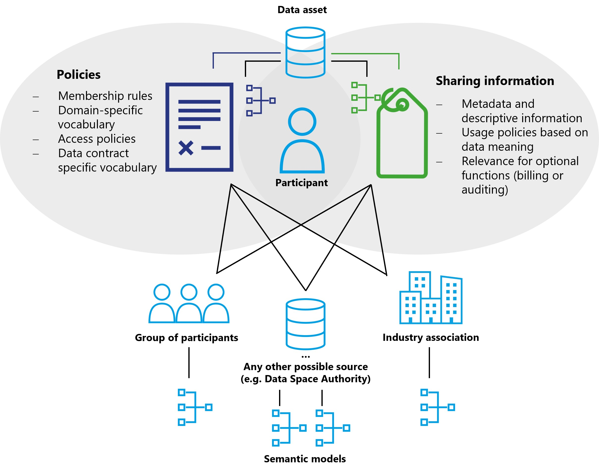

# Vocabularies

Vocabularies are used to ensure that everyone means the same thing when
using a specific term. There are multiple vocabularies that may be used
in a data space, but two are particularly noteworthy:

- **Semantic models for policies:** Structured models that define the terms, attribute names, and allowed values used in policy expressions; these models make policy requirements machine-interpretable and reduce ambiguity during reconciliation.

- **Semantic models of the shared data assets:** Domain-specific data models and ontologies that define the meaning and structure of shared datasets, enabling consumers to interpret and process data correctly and to enforce usage policies based on data semantics.

So far, this document mostly described how a data space works, what
contracts are, what types of policies exist, and how to negotiate a
contract. The vocabularies describe the content of these elements.

The first category is the vocabulary of policies, which can exist on
multiple levels:

- Semantic model for policies for membership rules\
    For example, if a data space wants to restrict membership to
    companies with a HQ in certain countries. It must be clear what the
    policy is called and what values are allowed.

- Policies that each member of the data space must understand to
    interact with other participants. For example, policies that specify
    which industry vocabularies must be understood, and access policies.

- A participant can publish additional information on semantic models
    relevant for the interaction with this participant. This could be
    special access policies under which this participant publishes
    additional contracts. It could be an access policy that specifies
    access for direct suppliers of this participant.

- Within the Data contract as a machine-readable specification that describes the contractual terms, associated policy constraints, and the semantic models required to interpret the asset. The data model, vocabulary, or usage rules that must be understood to correctly interpret and enforce contract-specific policies (for example, an industry-specific usage restriction expressed as a domain ontology).

The vocabularies for each level can be easily referenced by the metadata
publishing mechanism at the respective level. A data space can reference
the required policy vocabulary through its self-description. A
participant can also leverage its self-description to publish additional
vocabulary requirements. And at the data contract level, this
information can be easily stored in the metadata associated with the
contract at the catalog level.

For mandatory vocabularies a policy referencing them can be easily
established if such a policy model has been agreed upon.

Semantic models for data assets work on the same principle with the main
difference that they do not describe functionality of the data space
itself, but the meaning of the data being shared. If this data needs to
be understood to properly handle usage policies (e.g., if usage policies
are based on the meaning of data) it becomes an essential part to be
considered in the design of the data space. Semantic data models might
also be relevant for optional functions such as billing and auditing.

How best to manage the publication of vocabularies depends on the design
of the data space and its requirements. There can be central servers
hosting the semantic models, public semantic models from industry
associations that can be referenced externally, a group of participants
responsible for publishing and synchronizing common semantic models, or
semantic models that each participant receives when joining the data
space and which can be continuously updated through various
synchronization mechanisms.

## Optional functions

In addition to the functional elements of a data space, many optional
roles and components exist. The entities providing these functions must
join the data space like any other participant and fulfil all
requirements, policies and procedures enforced by the DSGA to establish
trust.

Depending on the services provided, these additional elements may need
to issue additional credentials, introduce additional trust anchors, or
require specific data contracts. There is a wide variety of optional
roles and services. Some especially useful ones are described here.

In general such optional functions can be distinguished as intermediary
functions or value-creating functions. Intermediaries can participate in
data spaces as value-creating services or functions.

**Intermediaries** are considered as optional in data spaces. Due to certain
regulations like the Data Governance Act, such intermediaries may require
additional governance.

**Value-adding services** may be realized by intermediaries or as function
of a data space participant. Such value-adding services are not subject
to the IDSA Rulebook, but are explained in the [DSSC Blueprint Version 3.0](https://dssc.eu/)
in more detail. The IDSA Rulebook provides a limited explanation below.
