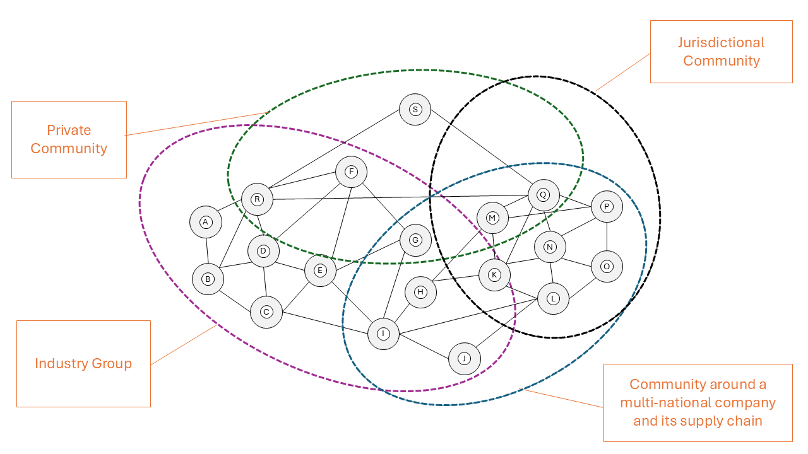

# What is a Data Space?

The ISO/IEC 20151 Standard "Information technology — Cloud computing and distributed platforms — Dataspace concepts and characteristics" defines Data Spaces as:

***"environment enabling trusted data sharing between participating parties, based on an agreed governance framework, along with an agreed set of policies, semantic models, standardised protocols, processes, and facilitating services"***

Let's try to unpack that and have a look at what all of that means:

- **environment** - An environment is more than just the infrastructure on which a participating party operates their software agent (typically a Dataspace Connector). It includes technical and non-technical elements that are comming together to enable the creation of trust which reduces risk when sharing data.
- **trusted data sharing** - Higher trust between two parties sharing data reduces business risk in the process of data. This can include many facetes: knowing the other party, understanding how they manage data, getting guarantees on how the data was created or how it will be used. Trusted data sharing enables two parties to share data with confidence, understanding the risk of that sharing and managing it well.
- **participating parties** - a data space consists of a community of participants which are following a common set of rules and have provided a minimum set of assurance about themselves to increase trust in them. Typically two participants of a data space operate directly, peer-to-peer without intermediaries. However, there are scenarios where intermediaries can be helpful to facilitate specific business use cases.
- **agreed governance framework** - The Data Space Governance Framework is the defined set of technical policies, business rules, and regulations that participants in a data space have to adhere to. It is the core agreement between all parties, which defines a data space. The Data Space Governance Authority is mandated to maintain and enforce the Data Space Governance Framework. The functional requirements section on [Data Space Governance Authorities (DSGAs)](006_DSGA.md) explains the functions, responsibilities and interactions of such a framework in more detail.
- **agreed set of policies** - Within a data space there are multiple layers of rules which ensure the creation of trust between two participants. Those rules are expressed as policies, specifically data space membership policies, access policies, contract policies and usage policies. More details on policies can be found in the functional requirements section on [Policies](105_Policies.md).
- **semantic models** - Sharing common semantic models on (1) the data that is to be shared and (2) the data that describes the data space itself (e.g. policies, participants, processes) between the participating parties greatly enhances the interoperability within the data space. Exchanging semantic models of the data shared further improves its use and enables value generation. [Semantic Models](115_Interoperability_in_data_spaces.md) are explained as well in great detail in their respective section of the IDSA Rulebook.
- **standardised protocols** - The incredibly rapid growth and widespread adoption of the WWW would not have been possible without common protocols, such as TCP/IP and HTTP, which enable software from many different vendors, servers at many different providers and browsers on different phones and computers to seamlessly work together. Data spaces are built on a similar set of foundational protocols that enable technical communication between participants, namely the [Dataspace Protocol (DSP)](https://eclipse-dataspace-protocol-base.github.io/DataspaceProtocol/) and the [Decentralized Claims Protocol (DCP)](https://eclipse-dataspace-dcp.github.io/decentralized-claims-protocol/).
- **processes** - Different communities will have different processes for onboarding and managing their community members. Having those processes clearly defined, governed and well managed enables smooth collaboration between participating parties.
- **facilitating services** - Many data spaces will cooperate with external service providers to support their operations and make data sharing easier and more secure. These services may include onboarding, auditing, marketplaces, and others. The IDSA Rulebook outlines key service categories and governance principles but does not provide an exhaustive list. As data spaces evolve, new business models, new governance models and services will naturally emerge.

## Autonomy and Agency

The most important aspect of data spaces is the **autonomy** and **agency** of a participant, commonly referred to as "digital sovereignty". Autonomy refers to the ability to decide whether to share specific data, with whom, and under which conditions. Agency refers to the ability to execute those data sharing decisions in practice. This is only fully possible if the participant controls all technical elements required to participate in a data space. Any external service that is mandatory (that is, required by the DSGA or by law/regulation) in the negotiation of a data sharing agreement or in the execution of such an agreement — for example, where a central or federated catalog is the only means to discover data or a marketplace is the only service that enables contract negotiation — reduces autonomy and agency.

However, full autonomy and agency come at a price. The participating party needs to have the ability and technical means to control all technical, business and legal elements of participating in the data space and negotiating contracts. For many participants this will be too expensive or too cumbersome in relation to the value of the data shared. In those cases data intermediaries can be used which will perform data space access functions and perform the sharing or use of data. As each function that is provided by a service provider impairs the participants digital sovereignty it needs to be carefully weighted which functions can and should be handed over to a service provider.

Especially for smaller organisations participating in data spaces that primarily serve regulatory purposes, it may be preferable not to connect directly, but instead to use an aggregator or portal provider that shares data with the data space on their behalf.

The IDSA Rulebook will explain the functionality, mechanics and processes of a data space from the perspective of a fully autonomous participant with full agency. Where applicable additional explanation will be provided how intermediaries, aggregators and other service providers can be leveraged to trade digital sovereignty for ease of access and operation.

## Communities

Data spaces are data ecosystems built on the concept of communities of trusted participants. There are many potential perspectives of what a community of participants can be. They can be based on a jurisdictional community (e.g. all participants are from the same country), industry group (e.g. all participants are energy providers, or health care providers), based on a common customers (e.g. a data space for all suppliers of a multi-national company), or any private community, for example founded to join forces on one very specific business use case.

Data spaces can overlap or be aligned hierarchically. As an example, the community of all European Healthcare Organisations is organised in the European Healthcare Data Space (EHDS), which can be segmented into smaller healthcare data spaces by country, while at the same time being segmented into separate data spaces by industry (e.g. pharma, hospitals, medical device manufacturers) and again be also segmented by a specific use case (e.g. cancer research, disease tracking).

No matter which community an organisation wants to participate in, it needs to have the technical means for participation. This includes, for example, operating a data space connector that supports the required foundational protocols and having knowledge of the relevant semantic models. In addition, the organisation needs to possess the appropriate credentials that prove its membership in the respective community.

Some communities will require significant effort to join (e.g. becoming part of a not-for-profit association, signing legal documents). Others may offer a more lightweight, low-friction onboarding process, for example when sharing open data for scientific research.

### International Cross-Border Data Sharing

Special attention is necessary when the community consists of organisations operating under different jurisdictions as this might create legal conflicts in the policies required to share data. While some might be relatively easy to resolve (e.g. data sharing within the member states of the European Union), others will require more investments to resolve conflicts and clarify ambiguous rules (e.g. sharing data between a Chinese and a German company as part of a supply chain data space).

The IDSA Rulebook can't provide detailed guidance for every potential permutation of jurisdictional communities or industry groups. However, it will provide the tools necessary to understand how to think about the issues involved in designing the rule sets for different communities and how that impacts certain design and operational aspects of a data space.

Data spaces technology is agnostic to the custom rules of the communities. It always operates the same way by following the specifications for the two core protocols DSP and DCP. Any customisation to the needs of specific communities starts with the semantic models, which are highly flexible and can accommodate any community need.

## Technology

Every organisation participating in a data space is represented by a software agent which acts on behalf of the organisation in the data space. These software agent implementations are commonly referred to as Dataspace Connectors. The most basic Dataspace Connector offers API endpoints for data discovery, data sharing contract negotiation, data sharing orchestration and for the management of decentralized attribute-based claims about the organisation. This functionality is fully specified in the [Dataspace Protocol (DSP)](https://eclipse-dataspace-protocol-base.github.io/DataspaceProtocol/) and the [Decentralized Claims Protocol (DCP)](https://eclipse-dataspace-dcp.github.io/decentralized-claims-protocol/).

Based on those two protocols any variety of software agents can be built. Standalone, single server deployments, Connectors-as-a-Service at a cloud provider, software agents as a feature of a large enterprise software, AI Agents with Dataspace capabilities, and many more. The concept is open to future innovation and interoperability is guaranteed through the protocol specifications which embody the durable core concept of data spaces.

## Business Models

Data spaces are agnostic to the business model(s) of the data ecosystem being enabled by them. It is possible to build data spaces that contain only free, open or altruistic data, others that are designed to share regulatory mandated data or others that are build around the idea of creating a marketplace for data. Any business model can be built on data spaces and with data space technology. Even platforms and aggregators can use data space technology to implement the need for a decentralized mechanism to negotiate resource sharing contracts.

Data spaces can also support more than one business model at a given time. e.g. same data that needs to be shared for free within the supply chain due to legal regulation can also be offered in a data marketplace to other companies at a price.

Data spaces are designed to foster future innovation in business models, data use, value creation and monetization.

The Internet and the World Wide Web have enabled new business models and monetisation strategies, creating significant value for the global economy and for individual users. Similarly, data spaces enable trusted data sharing, unlocking new insights, business models, opportunities, and value for all participants.
