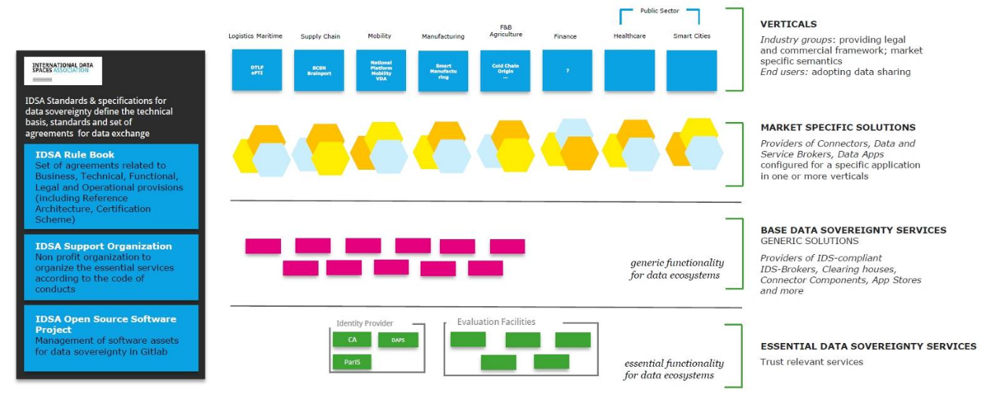

# Introduction

## Who should read this rulebook?

It is all about data. If you are using data-driven ecosystems or
data-driven business models, you should build or join a data space --
and therefore read this rulebook. And if you are not yet, think about
it!

Data sharing is becoming a critical success factor for all businesses
and organizations in all national and international economies. Data
access and sharing also helps in meeting specific societal, policy, and
legal objectives that are in the public interest. This rulebook covers
several types of data sharing: data sharing ecosystems, peer-to-peer
data sharing, data marketplaces and data-driven platforms.

The data space approach described in this rulebook is for anybody
interested in trusted and secure data access and sharing. It is relevant
to businesses, organizations and individuals wanting to learn how their
data rights can be handled in these data spaces.

## Goals and scope of the IDSA rulebook

### Goals of the IDSA

The International Data Spaces Association (IDSA) has defined a data sharing
scheme (IDS), including a reference architecture, open source building
blocks, and a certification process for creating and operating data
spaces. IDS is based on commonly accepted data governance models
facilitating secure sharing and easy linking of data within business
ecosystems. The goal of IDSA is to make IDS a global standard for
sovereign data sharing.

The most important design principle for data spaces is to ensure data
sovereignty for all data. This even enables the sharing of sensitive and
most valuable data assets between selected participants. The IDS scheme
guarantees data sovereignty for data owners who provide the shared data.
This is the basis for offering smart services and for establishing
innovative business processes.

IDSA defines the technical foundation and a set of agreements for secure
and trusted data spaces, where companies of all sizes and industries can
manage their data assets. The association already counts over one
hundred and thirty member organizations from twenty countries. The
interplay of all these organizations as data space participants and
service providers will deliver on the shared value proposition of
generating business value from data.

### The purpose and scope of the rulebook

The IDSA rulebook serves several purposes regarding the development and
operation of data spaces. The aim is to describe clearly which rules are
mandatory and which are optional guidelines. This governance framework
includes functional, technical, operational, and legal dimensions:

- Guidelines for the functionality of common services are presented as
    well as the definition, processes, and services of specific roles.

- Guidelines how to implement or use a technical artefact of the IDSA.

- Guidelines for the work and collaboration within data services.

- Guidelines for the legal basis in compliance with the regulatory
    environment to ensure trust and security.

This framework applies to all IDS-related roles and their interaction in
the specific environment:

1\. The IDSA support organization is responsible for maintaining this
rulebook and supports its application. It enables the orchestration of
processes and the realization of interfaces to other parties.

2\. The essential service providers make these services available to the
participants. They are the source of common agreements.

3\. All IDS users are getting guidance on how to proceed in realizing
use cases based on a trustworthy infrastructure and governance.

## Relationship with other initiatives

### Data Spaces Business Alliance (DSBA)

Four key European organizations (IDSA, Gaia-X, FIWARE, BDVA/DAIRO) have
formed an alliance creating one voice and a common framework to make
data spaces happen. Together, the DSBA represents 1,000+ leading
industry players, associations, research organizations, innovators, and
policymakers worldwide. With its combined cross-industry expertise,
resources, and know-how, the DSBA drives awareness and technology
adoption, shapes standards and enables integration of data spaces across
industries.

The aim of IDSA rulebook is to ensure compatibility with the common data
space framework as envisioned and defined by the DSBA.

### The Data Space Landscape

Further information on the landscape of data spaces are subject of a
dedicated IDSA publication, the Data Space Landscape\[to be published
end of March 2023\].

## Related documents

You can find additional information about IDS related elements at other
sources provided by IDSA:

• The IDSA website (<https://www.internationaldataspaces.org>) reflects
what we do, who we are and what International Data Spaces stands for.
Use cases illustrate the possibilities of the data economy and outline
the added value created by the IDS standard. The download center gives
access to the IDS Reference Architecture, papers and studies, scientific
publications, and marketing material. Our content is constantly updated
with news, blog articles, events and our regularly published magazine
DATA SPACES NOW!

• The IDSA GitHub repositories
(<https://github.com/International-Data-Spaces-Association>) see also
section 3.4
