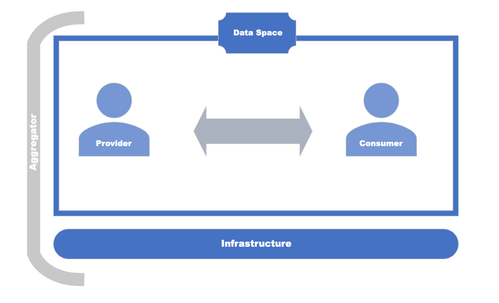

# Guiding principles

The IDSA rulebook is based on a set of generic principles and underlying
values. The key aspects are related to the governance of data spaces and
the roles actors can have.

**Not reinventing the wheel:** use proven technologies

**Integrate existing systems:** integrate data spaces into existing
systems to the extent possible

**Integrate or use existing standards**: align national and
international specifications, technical standards, and established
processes

**Industry and domain independent**: make data spaces applicable as a
concept as a horizontal standard

**Easy to use**: low deployment threshold for companies and initiatives
with a focus on portability and replicability

IDSA applies four key governance principles: accountability,
transparency, fairness, and responsibility. As a result, IDSA offers
free use of IDS specifications and related open resources for all, open
governance processes in which everyone can participate, transparent
decision making - preferably by consensus.

## Overarching considerations of data spaces

### Introduction

Data and technology -- and also data spaces -- are both: *never* neutral
and *always* neutral. They are never neutral in the sense that they are
always parts of complex, human systems which reflect the values of the
people involved. Data sets are collected by people, who decide what data
to collect and how. These choices, in turn, are linked to values, they
indicate what data people consider important to measure and collect.

Data and technology are also always neutral in the sense that they can
be used for purposes that support or go against the values of their
users and their societies. A classic example of this is nuclear
technology, which gave us both the atomic bomb and radiation therapy to
treat cancer.

To identify these aspects for data spaces we use PESTLE analysis - a
tool to describe a macro picture of the environment of a data space.
PESTLE stands for **p**olitical, **e**conomic, **s**ocial,
**t**echnical, **l**egal and **e**nvironmental. For each section, we
*describe* the (European) values embedded in IDS-compliant data spaces
and do *not prescribe* specific purposes for which these data spaces may
be used. This allows users of this rulebook to critically reflect the
values embedded in their own data space.

Solid values and ethics are fundamental to any technical implementation;
their absence has led to catastrophic effects on humanity. The use of
data needs good governance goals. We are deeply rooted in the European
values of freedom, inviolability, privacy, security, humanity, and
respect (without claiming to be exhaustive) and therefore include
considerations of values and ethics into the rulebook, and carefully
choose the path to the data economy weighing the impact on people and
societies.

#### **P** Political

*The political perspective in the European Union*

Data sharing and data sovereignty are at the core of the European Data
Strategy^11^ (2020). Recognizing that industrial and commercial data are
key drivers of the digital economy, the strategy uses "sovereignty" to
describe its ambition to keep control of data with those who generate
it.

Data spaces are an important means to strengthen digital sovereignty - a
cornerstone of the European Digital Decade proposal^9^ as highlighted by
EC President Ursula von der Leyen's State of the Union Address to
the European Parliament in 2020^10^. Data spaces will empower data users
and data holders to establish a healthy balance between the rights and
interests of all stakeholders involved. This is outlined in the European
Data Strategy - with the objective of a wide use of data.

The European Commission's policy proposal "Path to the Digital Decade"
aims for a digital transformation of the Union by 2030. The challenges
and objectives are described in the Commission's "2030 Digital
Compass"^12^. The Commission proposes several legislative instruments to
implement the European Data Strategy, notably: i) the Data Governance
Act (DGA, Nov 2020) with a focus on ensuring trust in data transactions,
ii) the Digital Markets Act (DMA, Dec 2020) regulating data based market
power; iii) the AI Act (2021) with implications for AI data governance
and data management; iv) the Implementing Act on high-value data sets
under the Open Data Directive to further unlock the socio-economic
potential of data as a public good, and v) the Data Act (DA, Feb 2022)
targeting a wide spectrum of  topics, including facilitating access to
and use of data by businesses and consumers, and enabling public sector
bodies and institutions to use data held by enterprises in exceptional
circumstances.

Challenges stem from the complexity of the legal framework (EU vs.
national, horizontal vs. sector-specific, economic law vs. fundamental
rights, etc.) and competing relationships between stakeholders in
data spaces. This highlights the need for legal interoperability: a
common understanding of the evolving legal environment, a common
vocabulary (legal-technical) and facilitating the implementation of
the balance between policy objectives. The realization of data spaces
requires policies that can adapt to respective specificities and their
dynamic evolution over time, while aiming at a common European data
space.

Finally, in the "EU Strategy on Standardization setting global standards
in support of a resilient, green and digital EU single market" the EU
emphasizes the importance of the success of European actors in
standardization at international level. It will strengthen Europe's
competitiveness, technological sovereignty, and will protect EU values.
One of the priority areas identified is "data standards enhancing data
interoperability, data sharing and data reuse in support of the Common
European Data Spaces".

#### **E** Economic

The overarching goals for IDSA include making more data available to
more organizations and ecosystems, recognizing that the availability and
sharing of data is a critical success factor for local, national, and
international economies.

Economic benefits happen in a data space at two levels: directly through
sharing or accessing data that is of value to participants (micro-level:
ego-system) and indirectly through supporting/creating a larger
ecosystem that benefits all participants (macro-level, eco-system).

A digitally supported value chain can facilitate collaboration and
improve resilience by identifying deviations or threats early (for
example resource scarcity in a value chain). Access to even broader
collaboration can unlock potential when multiple data spaces are
connected.

In terms of fairness, benefits can be spread throughout the value chain.
Often large benefits can be achieved at a later stage at the expense of
efforts at an earlier stage. Consensual agreements in the data space can
make this mutually beneficial.

#### **S** Social

The social values embedded in the work of IDSA data spaces are European
ideals such as freedom, inviolability, privacy, security, humanity, and
respect. Issues such as gender equality, socio-economic opportunity, and
cultural representation are relevant wherever data is collected. Exactly
*how* these values manifest in each data space is up to the implementer
to decide - in collaboration with all stakeholders. The needs and
priorities of specific economies, ecosystems, and communities vary. Our
overarching societal value commitment is *pluralism* of *interoperable*
and mutually *respectful* data spaces whose values and priorities are
defined in an *inclusive* manner.

#### **T** Technical

Data spaces should be built on widely established and openly accessible
protocols, standards, and technical frameworks. Interoperability
standards define the boundaries between two objects that have gone
through a consensus process. The consensus process should have a narrow
technical focus (like W3C, OASIS). W3C has developed processes and
policies that promote the development of high-quality, consensus-based
standards, many of which power the web and enterprise computing. ISO and
IEC are adopting W3C technology and guidelines for a broad industry use.

When standards are adopted successfully, best practices show that the
industry needs to establish feedback loops. Community-driven open source
implementations demonstrate the feasibility of the defined reference
architecture. An MVDS (Minimum Viable Data Space) gives a first
impression of how technologies can be plugged together. This is the
first step to starting projects for specific use cases and gives
feedback to the developer community. Market needs will drive the
interfaces of commercial products and services. The feedback loop
between use cases and used data products will improve interoperability.

Distinguish between mandatory (MVD) and optional requirements (discuss
essential principles and optional one)

The ["Public money, public code" campaign](https://www.kocos.com/news/blog/articles/article/2021/10/18/some-facts-about-the-energy-consumption-of-digitalisation) wants legislation to
require that publicly funded software developed for the public sector to
be made publicly available under a free and open source software
license. IDS-G is where the developer community finds the reference
implementation of all components - available under free licenses. We
recommend hosting all technical developments there and ask to contribute
to further development.

#### **L** Legal

There is a strong connection between political and legal factors.
Legislation follows political decisions. Besides knowing the existing
legislation, the impact of new and planned regulations based on
political developments must be taken into account. Political and social
sentiments need to be considered.

Legal fields to bear in mind when sharing data include
antitrust/competition, data protection and security, copyright,
patents/intellectual property. The European Data Strategy mentioned
above brings a higher level of regulation to data sharing in the EU,
including the [Data Governance Act (DGA)](https://eur-lex.europa.eu/legal-content/EN/TXT/?uri=CELEX%3A32022R0868), the Proposal for [Data Act
(DA-E)](https://eur-lex.europa.eu/legal-content/EN/TXT/?uri=COM%3A2022%3A68%3AFIN), [the Digital Markets Act (DMA)](https://eur-lex.europa.eu/legal-content/en/TXT/?uri=COM%3A2020%3A842%3AFIN), [the Digital Services Act
(DSA)](https://eur-lex.europa.eu/legal-content/EN/TXT/?uri=CELEX%3A52020PC0825) and the [AI Act](https://eur-lex.europa.eu/legal-content/DE/TXT/?uri=CELEX%3A52021PC0206). If a data space operates globally the
legal framework becomes more challenging since each country has its own
rules and regulations.

#### **E** Environmental

Data usage - collecting, processing, or federation - has a huge and
growing impact on our planet. The EU Data Strategy states that making
more data available and improving data use is essential to address
societal, climate and environmental challenges, contributing to a
healthier, more prosperous and sustainable society. It will lead, for
example, to better policies to achieve the objectives of the European
Green Deal. At the same time, the current environmental footprint of the
ICT sector is estimated at 5 to 9% of the global electricity consumption
and more than 2% of all emissions, a large part of which is due to data
centers, cloud services and connectivity. The EU's digital strategy
"Shaping Europe's digital future" proposes green transformation measures
for the ICT sector.

The choice of implementation design can have a significant impact on the
energy consumption of digital tools. We strongly recommend an ongoing
assessment of the key components and technology that determine the
energy profile of data spaces and services. For distributed ledger
technologies, for example, the main factors affecting energy consumption
are the ability to control participation and the consensus algorithm.
While cryptocurrencies like Bitcoin waste resources, other approaches
may be more energy efficient than existing payment systems.

When developing data spaces special attention should be paid to
sustainable digital technologies. AI-based services and state-of-the-art
data mining technologies can increase resource efficiency, optimize
supply chains, improve coordinate sector coupling and thus lower
emissions and add value. Avoiding rebound effects with digital
technologies is an important goal. Continuous monitoring and sustainable
design should ensure that the use of digital technologies has a net
positive impact on the climate footprint.

## Layers of data space governance

The layers of data space governance (Figure 4) are inspired by the
Design Principles for Data Spaces[^7] publication. This was developed in
the context of the OPEN DEI project funded by EU where data spaces
experts teamed up to define cross-sectoral principles for building data
spaces.

  --------------------------------------------------------------------------
  **Layer​**        **Description​**
  ---------------- ---------------------------------------------------------
  **Data space     Executes and implements the governance practices and
  instance         rules of a data space instance. Oversees data space
  governance**     functions and the rules.​

  **Data space     Defines the rules for the data space instance. Creates
  ecosystem        the intra data space trust between collaborating
  governance​**     organizations. Complements standardization and regulation
                   focusing on business-driven rules. Defines the inter data
                   space interoperability practices.​

  **Data space     Establishes sector-specific data space principles and
  domain           mechanisms including semantic interoperability and
  governance ​**    domain-specific regulation. Leaves room for geographical
                   differences while supporting maximum interoperability.​

**Soft           Brings all the generic data space building blocks and
  infrastructure   concepts together, defines the legal basis and creates
  governance​**     the common framework on which all data spaces are built.​
  --------------------------------------------------------------------------

[]{#_Toc126649306 .anchor}Figure 4 Four Layers to describe data spaces
governance

## Data economy with digital sovereignty

Using IDS based frameworks, services and offerings guarantees data
sovereignty for your business.

There are some common rules and guidelines:

\- Common definition on lifecycle agreements for IDS-based assets, the
IDS standards and services. See appendix "Operational Agreements, Life
Cycle".

\- General definitions of necessary processes for development,
certification, onboarding, operation and usage. See appendix
"Operational agreements. Processes".

Typical roles of an IDS based data space are described in more detail in
a following chapter. Some papers will also address the different roles
with examples of use cases and business models.

In summary, using IDS with its data sovereignty is a competitive
advantage for your own business and quite easy to do, since everything
is well prepared. The IDSA website provides all information
(<https://www.internationaldataspaces.org>). A hotline can help with
questions (SupportOffice@internationaldatspaces.org).

## Governance/legal framework

Relationship of data usage control and other types of control
enforcement and legal agreements

EU policies set the framework for data spaces, but each instance will
need additional governance. This rulebook helps you put that governance
in place. In this section, we briefly cover the relevant EU regulation
for data spaces: DGA, DA, eIDAS2, GDPR, NIS2, others \<pls add!\>. In
chapter 6, we cover the contractual aspects of setting up the governance
for a data space instance.

## Role models

Roles in this rulebook describe functions, and no status. The model
definition of roles should provide clarity about tasks and capabilities
and support the understanding of architectures and interfaces. Roles may
not always exist in their pure form - mixed forms are often experienced
by participants in data spaces - and new or more specific roles will
emerge over time. In this section we define the most important and
common roles without claiming to be exhaustive. In practice, it has
proven useful to first implement the essential roles that are necessary
for the data space to function. Three roles should be established first:
provider, consumer, and intermediary services.

### Data consumer (essential)

The term data user means a natural or legal person who has lawful access
to certain personal or non-personal data and has the right, including
under Regulation (EU) 2016/679 in the case of personal data, to use that
data for commercial or non-commercial purposes.

### Data provider (essential)

The term data holder means a legal person, including public sector
bodies and international organizations, or a natural person who is not a
data subject with respect to the specific data in question, who has the
right to grant access to or to share certain personal data or
non-personal data in accordance with applicable Union or national law.

### Service Provider (intermediary, operator, aggregator)

**Aggregator** -- combining data from multiple sources for computation
at one partner (Specialization: data trustee)

**Intermediary** service aims to establish commercial relationships for
data sharing between a number of data holders and data users. This is
done through technical, legal, and other means; it includes to exercise
the rights of data subjects in relation to personal data; it excludes at
least the following:

- services that obtain data from data holders and aggregate, enrich,
    or transform the data to add value and then license it to data
    users, without establishing a commercial relationship between data
    holders and data users

- services that focus on the mediation of copyright-protected content

- services exclusively used by one data holder to enable the use of
    the data held by that data holder, or used by multiple legal people
    in a closed group, including supplier or customer relationships or
    contracted collaborations, in particular those who want to ensure
    the functionalities of objects and devices connected to the IoT
    (Internet of Things)

- data sharing services offered by
    public sector bodies that do not establish commercial relationships.

