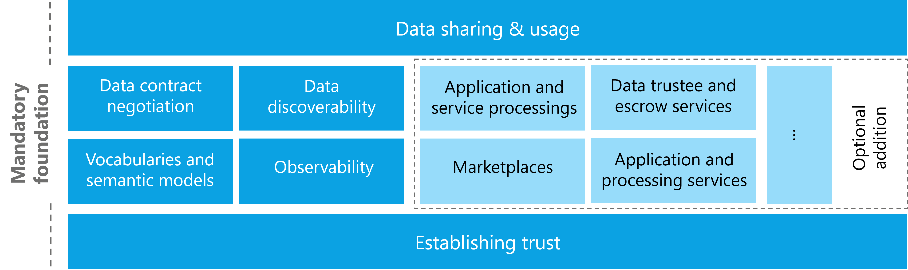

## Foundational concepts of a data space

The foundational concepts of a data space:

- Establishing trust
- Data discoverability
- Data contract negotiation
- Data sharing & usage
- Observability
- Vocabularies and semantic models

Additional elements that support these main functions of a data space
can include these optional functional areas:

- Application and processing services
- Marketplaces
- Data trustee and escrow services
- Data incubation and service creation

