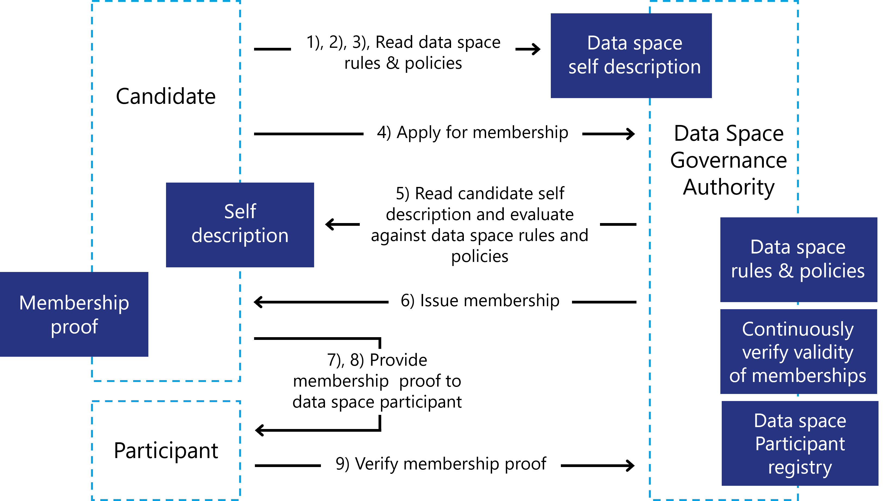

### Data space participation

Participation in a data space is based on fulfilling all the policies,
rules and procedures that are mandatory for membership. In its simplest
form, these may just be technical or automatically verifiable policies.
In more advanced cases, these can be more complex policies and rules
that potentially require lengthy workflows with human interaction to
verify eligibility to join a data space (e.g., a signed legal contract
with a central operating company, membership in industry associations).

The procedure to join a space will likely include the following steps
for the applicant (details can vary due to the design and purpose of the
data space):

1. Candidate discovers the data space and the corresponding DSSD\
    This can be achieved through human interaction, a website of the
    data space, finding the [DID](https://www.w3.org/TR/did-core/) of the data space in some registry
    or through automated discovery protocol of existing participants
    among other things.

2. Candidate reads the DSSD and receives information about the policies
    and rules of the data space, as well as technical configuration
    information for endpoints and protocols.

3. Candidate evaluates the policies and rules and prepares additional
    information needed for the requirements when applying for membership
    in the data space.

4. When all information and necessary proofs are collected the
    candidate applies for membership through the registry function of
    the DSGA. The technical implementation of the data space registry
    might vary based on the requirements.

5. The DSGA requests proofs for all policies. This might include VCs and
    proof of technical capabilities, but also workflows including human
    interaction (e.g., signing a membership contract).

6. Once all policies have been satisfactorily processed the DSGA issues
    a VC/ proof of membership and sends it to the candidate, moving them
    from applicant to participant.

7. The new participant sets up all the necessary technical components
    for participation in the data space.

7. The application process is complete,
    the participant can start interacting with other participants
    (sharing data, browsing the catalog(s) for data of others,
    negotiating data contracts).

