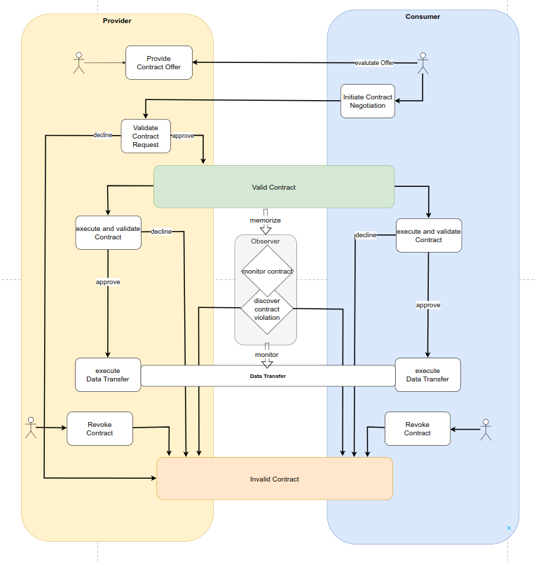

### Data sharing

Once a participant has joined a data space and discovered available data
contract offers, the mechanism of data sharing is initiated. Data
sharing is the core activity to enable further data processing and value
generation by using the data.

Data sharing is a very broad term in this context. It ranges from a
one-time transfer of a file, access to an API, registering for an
eventing service, subscribing to a data stream, also including data
sharing methods where the data remains at the source and algorithms and
processing code are copied to the data location for in-place processing.
Data Sharing does not require a physical move of the data asset,
although this will be frequently the case.

However, before data can be shared, a data contract offer needs to be
negotiated to reach a data contract agreement (DCA) which specifies all
policies and details of the data sharing process.

#### Contract negotiation

A contract negotiation (CN) serves the purpose of reaching an agreement
to share a data asset between two participants of the data space. During
the CN policies of the DCO are evaluated against the attributes of the
requesting participant, and VCs are verified with their issuers. Note
that while any trust anchor is an issuer of VCs that can be used to
evaluate policies, there might be additional external issuers that need
to be validated (e.g., government agencies, regulators, industry
associations)

It is important to note that the CN does not automatically lead to an
immediate data or algorithm transfer. The result of a CN is a data
contract agreement, which then can be executed at a later point in time.

Imagine a scenario where multiple roles are involved in the process of
data sharing in a large enterprise. The person negotiating the DCA might
not be the same one who is responsible for sharing the data. Or there
might be data assets that can't be immediately shared after the
agreement is reached (e.g., an event notification that can only be
consumed until the event in questions has occurred).

**Data sharing execution**

When it is time to share the data, it might be necessary to re-validate
the policies of the data contract agreement as significant time might
have passed since the contract negotiation. The decision whether to
revisit all policies might depend on each party's business rules. If
data needs to be highly protected or requires specific regulatory
processes for handling it, it is advisable to conduct an additional
review.

To exercise a data contract agreement (which could also be code to
process data), data needs to be moved from one participant to another.
This can be done either by a push model in which the participant with
the data asset pushes the data to the other participant or by a pull
model, in which the data asset is made available to the consuming
participant via a link.

The data transfer technology depends on the type of data asset, trust
level, availability of technical protocols, infrastructure environment,
and other factors. All data transfer technologies must be able to be
orchestrated. Orchestration at this level means having technical control
over the data sharing process, allowing the connector to start and stop
the transfer, as well as having the necessary technical capabilities to
monitor the progress of the transfer and to receive information about
compliance with usage policies.

The transfer itself needs to ensure security, performance, and
manageability. For example, a data stream can be provided from multiple
data centers to enable a highly available data sharing architecture.

When data is not moved but a "code to data" approach is selected, the
push and pull behavior is reversed: The consumer participant provides a
data asset containing code (source code, compiled library, signed
container) to the participant providing the data. This can be
implemented like any other data asset transfer with a push or pull
mechanism.

Data sharing must accommodate a wide range of scenarios. From a simple
file transfer between two storage providers, to API access for streaming
or eventing, to quite complex implementations with secure execution
environments through confidential compute enclaves, environment
attestations, signed code, custom encryption algorithms, and more. Which
solution is right depends on the protection needs of the data and the
trust level between the participants.

The transfer technology can be specified as a policy in the data
contract agreement, or it can be implicitly inferred by the type of data
asset being shared. A participant who wants to ensure that data never
leaves an environment where full control over its usage is guaranteed
can enforce the selection of the transfer technology and storage and
processing infrastructure by setting policies in the contract and
monitoring compliance.
