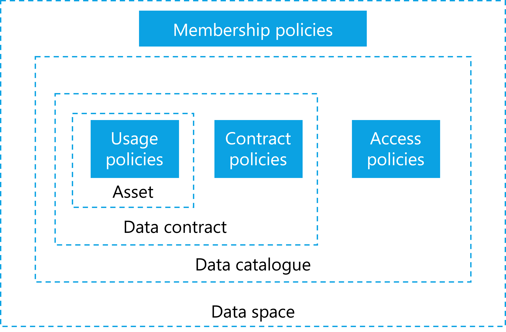

### Establishing trust

Establishing trust is fundamental to a data space. To create value from
data, it needs to interact with other data and then supports decision
making. The different entities must trust each other - without trust,
data will not be shared. Data spaces can create context-specific trust
where trust did not exist before or where it is difficult to establish
-- for example between competitors.
#### Attributes & self-descriptions

When people build trust with each other, they evaluate attributes of the
other person: attributes that are immediately verifiable (e.g., a
language spoken) or attributes that require an external authority to
verify them (e.g., a passport). To build trust, these attributes are
matched against (personal) policies. If a sufficient number of policies
are met, trust is established. Based on the attributes that have been
evaluated, different levels of trust can be negotiated.

To create trust in a data space a very similar process is used. It is
necessary to evaluate attributes of participants and match them with the
requirements, policies and rules of the data space, the participants,
and individual data contracts.

A data space needs to define policies that specify what attributes an
applicant must meet to become a trusted participant. This is achieved
through a data space self-description (DSSD), that allows new members to
provide attributes in their participant self-description (PSD) in a
format that can be understood by the data space governance authority (DSGA).
Therefore, the DSSD must include a reference to a semantic model that
describes the acceptable policies, their names, the potential value, and
the format in which those values are accepted.

For example, one data space might require self-descriptions to be
expressed as verifiable presentations in a single presentation per
attribute, while another data space might require self-descriptions to
be expressed as one large file containing all information serialized as
JSON-LD for the attributes and corresponding signatures. While
participants might manage the values of the PSD through application
services which enable complex data management and a permissions system
for editing, these services must render the self-descriptions in the
desired format that each data space requires at an appropriate service
endpoint for that data space.

Trust in a data space needs to be rooted in one or more trust anchors
and trust frameworks. These are similar to mechanisms that citizens use
in their daily lives: The level of trust depends on the authority that
issues them, such as a department of traffic issuing drivers licenses or
a ministry of internal affairs handing out citizen ID cards. The
underlying process is verifying a specific attribute.

A trust anchor
is an entity that issues certifications about an attribute. The
accompanying trust framework is the set of rules imposed by the trust
anchor to comply with its policies. Only then is the applicant eligible
for its attribute verification. For example, a company must follow the
laws of the country it is based in to obtain a valid company registry ID
issued by its government.

Deciding which trust anchors and trust frameworks, and thus which rules
and procedures of issuing and validating attributes are used, is the
responsibility of the DSGA and of the participants of the data space.
Details can be found in the certification section. For the data space
functionality, the concepts of trust anchor and trust framework form the
basis for the attribute-based trust mechanism.

In order to use of the concepts described above, the DSSD needs to
contain information about which trust anchors and trust frameworks are
accepted as roots of trust. Is it a sovereign entity that is the sole
root of trust, or is it embedded in a larger ecosystem of external trust
anchors and trust frameworks? Based on this, a potential participant can
make the decision whether to trust the data space and its members or
not.

The DSGA is also responsible for issuing membership credentials. It
ensures that an appropriate mechanism is provided for identifying and
verifying membership. In a centralized data space this could be the
issuance of a data space specific identity to interact with other
members. In a largely decentralized architecture, it could be the
issuance of a tamper-proof credential, such as a W3C verifiable
credential (VC) which provides proof of the attribute of membership.

The DSGA also performs other functional roles not directly related to
building trust but necessary for the operation of a data space. These
are primarily the mandatory function of regulating the lifecycle of
membership (participant discoverability, issuing of membership
credentials, verification services for membership proofs), but also many
optional services like observability and auditing, brokering and
marketplaces, providing vocabularies or other services required by the
data space members.

The communities coming together in the data space needs to make
decisions for the setup. Whether a centralized DSGA is required, or a
more federated or even fully decentralized model is appropriate must be
reasoned over when the data space is founded, as these architectural
choices are very hard to change later. Where on this spectrum of
possibilities an optimal design for a data space can be found depends on
the context and purpose of the data space.

#### Policies

Policies ensure a trusted data ecosystem within a data space. They are
used at multiple levels and at almost any interaction point. The two
main policy groups that are central to the functionality of a data space
are access policies (which control access to contracts) and contract
policies (which control the contract terms and the usage of data). While
the use of policies can be expanded by custom design within a data space
there are several fundamental policy points that enable the operation
and are therefore essential to understand.

It is essential to use policies for attribute-based trust in a data
space. Which policies need to be mandatory depends on the design and its
requirements. One data space might require policies that reflect the
sensitivity of health data in an international setting, while another
data space will need to enforce policies for national energy regulation.
Therefore, data spaces must define their own policies and communicate
them clearly. Participants may always choose additional policies in
their data contracts to further restrict access and use.

In a centrally managed data space, the DSGA might simply define the
ontology of policies. In a decentralized data space, there might be an
additional negotiation protocol that enables participants to agree on
the policy for their interaction.

Policies generally express three possible restrictions: prohibitions,
obligations, and permissions. Constraints expressing a rule can be
combined into more complex rules, which then form the applicable policy.
For example, a group of data space participants may only allow access to
their data for participants who belong to the same industry association,
allow to process data under the condition only anonymized results are
produced, and then permits to share the results with a third party for
processing if they meet a set of ISO
standards.

As discussed above, the first line of policy defense is the membership
policies (MP) and rules required to join a data space. These policies
ensure that only companies with certain attributes they can verifiably
prove, can join. These could be policies that verify the applicant's
nationality, industry certification, membership in industry
associations, but also policies that would require human interactions
and complex workflows, such as a valid contract with the DSGA that must
be negotiated before an applicant can become a participant.

Once an applicant becomes a participant, the next set of policies
becomes relevant: access policies (AP). An AP defines which attributes
must be available to access data contracts. A participant that does not
have access to a specific data contract should also not be able to see
the contract offer in the catalog. Optional services, like a
marketplace, should adhere to this principle as well and only show items
based on matching access policies and participant attributes. In a
scenario where contract offers should be made visible to everyone, the
access policy can also be expressed as an empty policy, not triggering
any restrictions. From a functional perspective, an access policy always
needs to be present, even if it grants access to everyone. A common
scenario is policies that grant access to anyone within the data space
but hide the associated item from queries by non-members (in case the
catalog endpoint is publicly accessible).

Each participant can define such policies, whether providing or
consuming data. For example, a participant interested in data could
define a policy to see only data with a distinct proof of origin, and
participants offering data could restrict access to their data to
members of a certain jurisdiction. This is often referred to as provider
policy and consumer policy.

When a participant has access to a data contract offer (DCO) the next
set of policies comes into play. A DCO can have contract policies (CP)
that define what attributes are needed for a data contract agreement
(DCA). CPs review attributes that must be provided at the contract
negotiation. This could be as simple as ensuring that the participant
uses a specific encryption algorithm or software package -- both of
which could be verified with a technical handshake procedure (e.g.,
sending a piece of information and requesting the properly encrypted
version). A more complex attribute example involving human interaction
is the association of the data contract with a legal contract between
the two parties that typically occurs outside of the data space
processes. The negotiation of policies can be on the spectrum of 100%
machine-processable and immediate to a human workflow potentially taking
a long time.

A contract may also specify policies for the transport mechanism for the
data asset transmission: like requiring a protocol, specifying pull or
push of data, mandating a data sink in a specific geographic area and
other details.

CPs may also include usage policies (UP) that take effect after the data
is transmitted and control how the data can be used by the receiving
party. Depending on the value of the data, use cases, trust levels,
contracts in place and many more attributes, there are different
possibilities to enforce UPs which come at varying costs.

For data with low importance or data not under a specific legal
protection, it might be too expensive to build a system that guarantees
control - it may be sufficient to simply monitor data use and fall back
to a legal contract should misuse of the data be detected. Other data
might be very sensitive, legally regulated, or costly and require
stronger protection and higher technical costs.

When designing a data space and deciding which data to share, it is
important to understand the data's classification, and regulatory
controls to design not just the right policies but also to mandate the
appropriate level of technical components that ensure proper handling of
the data.
  
| **Example**  |    **ProtectionNeed** | **Explanation** |
| :------------| :--------------------: | :---------------|
| Public weather data | low | Some data sets are already publicly available and can be shared without enabling others to derive sensitive data about persons or business secrets. |
|  Shipping information | medium  | Some data are valuable and at large scale likely to be highly protection worthy as they can give insights into business relations and transactions. |
|  Personal health data |  high | Personal health data are highly protection worthy due to strong laws and potential danger to the individual in case of data misuse. |
| Machine operations data | high | Industrial data is also usually of high value due to the sensitive business information it represents.|

The atomic expressions of policies can be further broken down into a set
of restrictions against which machine-readable attributes can be
compared.

#### Attribute based trust

Establishing trust based on attributes is a control mechanism. A
participant's level of trust is determined by evaluating participant's
attributes, data contract, data asset, and environment attributes. This
evaluates the potential risk of sharing data with another participant.
This trust level is also based on the participant attributes, the
attributes of the data space and the attributes of the data shared in
the data space, as well as the applicable trust anchors and trust
frameworks. It can express complex rule sets that can evaluate many
attributes. There is no limit to the attributes that can be defined and
the expression of policy rules to evaluate those attributes.

Depending on the level of risk that can be tolerated for sharing an
asset, restrictions need to be put in place. The restrictions are
expressed through policies as described above. The proofs of adherence
to the policies and rules are expressed through the participant
self-description (PSD), as well as additional attributes that might be
provided by the participant outside the self-description (e.g., proof
that commercial contract for the data exists and that payment for the
data has been submitted).

Attributes can be atomic expressions (e.g., the other entity is a
participant of a specific industry association) or a set of multiple
atomic expressions (e.g., the other entity is under a specific
jurisdiction and the destination for the data transfer in a specific
country). Attributes can be compared to static values (e.g.,
jurisdiction = country) or to one another (e.g., both parties support
the same encryption algorithm).

Many situations will required attributes that are complex and might
require complex workflows that can include human intervention. It is not
possible to generally answer how to handle extended and complex
attributes. This is a question of the design of the data space and its
rules.

Attribute based trust provides a dynamic, context- and risk-aware trust
model, that enables precise control by including attributes from many
different information systems with customized rules. It allows
participants flexibility to build and use different implementations
based on their requirements.

#### Data space policies and rules

As introduced above, data spaces require membership policies (MP) as
first barrier to their data space. There must also be a trust basis to
prove compliance with the policy, and an appropriate mechanism to allow
each participant to verify that their counterpart is adhering to it.
Every data space must define what level of trust is the minimum for
members. Each participant can verify other participants membership
through a digital signature mechanism provided by the data space or
separately verify compliance with data space policies and rules as
needed (e.g., if especially sensitive data is shared, all relevant
policies and self-descriptions can be evaluated ad hoc to ensure the
necessary trust level). Additional trust frameworks (e.g., the Gaia-X
trust framework) can be used to provide additional compliance
mechanisms. The data space could even be its own trust anchor. The
participants decide whether to trust the DSGA and its trust anchors.

The first level at which policies take effect in a data space is the
membership level. The next level is the catalog: Every participant
should only see items in the catalog that match the permission resulting
from matching the participant's attributes to the access policies of the
catalog. A contract offer should only be visible to those participants
who have the right to access it, to minimize unintentional sharing of
information. During the negotiation process for a data contract, the
detailed policies of that contract will be applied. Some of those
policies may be fully evaluated at that time while others may not be
evaluated until later when the data transfer is made or after the data
has been received. We refer to these policies as contract policies (CP)
and highlight the sub-group of usage policies (UP) because of their
importance in data sharing.

It will be impractical for many data spaces to act as the root of trust
as they would need to provide the necessary service functions. (e.g.,
compliance service to verify external attributes). Also, many data
spaces will require multiple external roots of trust, whether for
regulatory purposes, legal requirements, or simply because of existing
trust in established organizations.

A key question of a data space is therefore which roots of trust are
considered acceptable and whether any should be rejected. Since this is
an attribute of the data space it can be expressed through the data
space self-description (DSSD) and its acceptance mandated by the
membership policies encoded in the DSSD.

Another element needs to be part of the DSSD - the mandatory policy
information model for the data space. Every data space needs to define
the vocabulary to ensure a common understanding of the meaning of the
policies. There might be different meanings to the same policy
expressions in different data spaces. Therefore, is has to be done
individually.

This shows how important the DSSD is for the interaction with the data
space functions and to clearly understand the context and risk factors
of the data space. A data space needs to have an identity -- not just to
be clearly identifiable for the participants and potential members, but
also because the identity is the root element to which the DSSD is tied.
As mentioned above, the decision on how the functional elements are
implemented and expressed through the functional role of the data space
governance authority is highly dependent on the needs of the data space and is the
most important decision to be made when designing a data space.

#### Participant information

Information about a participant must be discoverable and understandable
for other participants - also to enable a clear understanding of the
attributes of the participant. Therefore, a participant needs a
participant self-description (PSD) that follows a known format and
protocol, as well as an ontology that describes the semantics of the
attributes.

The format of the PSD can be defined through the DSGA and may be a part
of the membership policies for the data space. In many cases, the format
and ontology of the PSD also depend on the selected trust anchors and
trust framework. For example, a data space that wants to use Gaia-X as a
trust anchor and leverage its trust framework must understand the Gaia-X
self-description structure and the meaning of the Gaia-X
self-description attribute definitions. A data space might require
multiple self-description ontologies (e.g., one trust anchor specific
and one industry specific) which can lead to ambiguity or conflict of
definitions, which have to be resolved by the DSGA.

The technical representation and communication of the PSD may vary from
one data space to another and will be influenced or mandated by the
trust anchor(s). One trust anchor and its trust framework might require
attributes to be presented as verifiable presentations when queried,
while another might require the possibility to request a set of
attributes serialized in a specific resource description format, and a
third one might require that all attributes be made discoverable in a
database that's available to all members for query at any time.

Entities that are participating in multiple data spaces at the same time
must manage their self-description attributes in a way that reliably
keeps attributes up to date, but also filters which ones should be
available in which data space and serialized in which format. For larger
enterprises with complex roles and responsibilities related to the
information contained in the attributes, this might include approval
processes and audit functions to track value changes to sensitive
attributes exposed by the self-descriptions.

Information exposed through participant self-descriptions (PSD) is used
in many policy evaluations throughout the data space. A non-exhaustive
list of examples is:

- Information for the registration process to evaluate whether an
    applicant can become a participant.

- Matching participant attributes to access catalog policies to only
    show items this participant is permitted to see.

- Automated matching of attributes to policy requirements in the
    contract negotiation process.

Self-descriptions can also be used to convey purely technical
information about a participant. For example, at what address can
another participant communicate with its catalog or connector with this
participant, what encryption techniques are supported. Whether this
information is stored and distributed in the same way as the PSD is a
question of the data space design. A data space that is using
centralized components for all mandatory functions will not require a
per participant discovery mechanism, while a more decentralized design
will require some discovery functions that can be implemented through
the same mechanism as the PSD or possibly through separate protocols.

