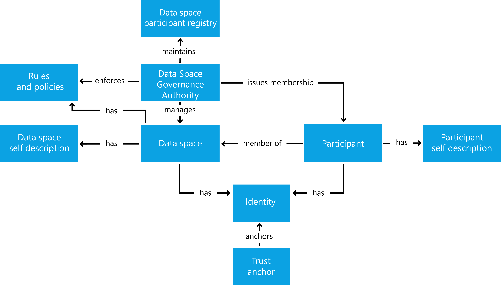

### Creating a data space

After discussing how to join a data space the question is: How do you
create a data space? The answer depends again on the purpose of your
data space and the needs of its participants. Regardless of whether the
data space is organized in a centralized, decentralized, federated or
hybrid manner, common denominators and basic functionalities can be
found.

A data space establishes trust within a community to share data with
each other. The definition of community can be very broad. It might be a
tight knit, small community of one company and its suppliers, or a large
community with many participants. Some data spaces are created for a
narrow use case and purpose others for many use cases that are relevant
for a group of participants.

Many decisions need to be made when designing the data space, here some
of the more common ones:

- Is the membership closed to a small, known group or open to a larger
    range of participants?

- Do you want a central party with additional privileges (e.g.,
    exclusion of participants for bad behavior) or is the independence
    of the participants and their autonomy the most important design
    factor?

- What level of technical maturity is expected from the participants?

- What type of data is shared and for what purpose?

Answering these questions helps you make the design choices between
architectures and deployment patterns of data spaces.

Once all design decisions are made, the functional elements are planned:

- Rules: What behavior and skills (technical and organizational) are
    required?

- Policies: the participation rules expressed and verified in policies

- Membership certification: What mechanism is used to verify a
    membership?

- Participant registry: Where can participants see who is
    participating?

- Identity system: centralized or decentralized identities - control
    over participants

- Catalog(s): one central, multiple federated or individual
    decentralized catalogs?

Working through the above list of mandatory functional elements will
clarify the architecture pattern for the data space, which will also
mandate a specific design of the data space governance authority. Now the DSGA needs
to be implemented to create the data space:

1. Create an identity for the data space
2. Provide a self-description

  - Membership policies
  - Trust anchors and trust frameworks
  - Attributes that will help participants decide which level of
        trust to apply for
  - use of the technical components as required according to the design
  - Participant registry
  - Registration service
    - Provide the workflow to apply for membership
    - Validate whether applicants comply with membership requirements
    - Issue membership credentials
    - Revoke membership credentials

3. Provide a discovery mechanism for the data space (website, contact
    form, etc.)

Once the DSGA is instantiated, organizations can apply for membership.
After a participant joins, there are two main activities that all
participants are interested in: discovering data shared by others and
sharing their own data in a controlled manner to ensure autonomy and
agency over the data. This is the core functionality that any data space
provides. Additional functions and services such as marketplaces, data
escrow services, processing services and applications might be provided
as optional elements.

