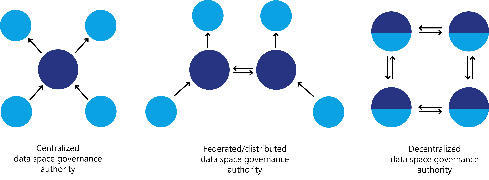
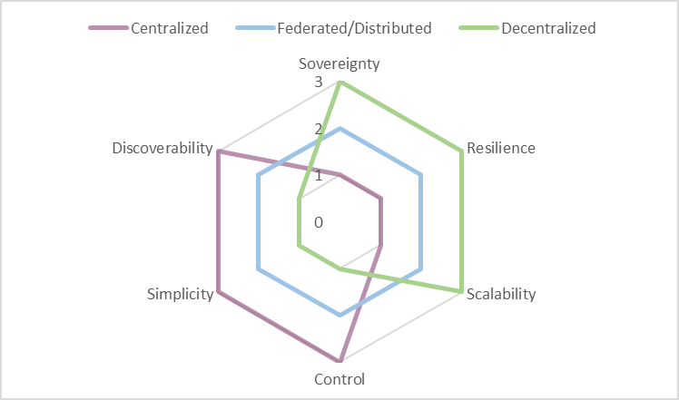

### Vocabulary

The semantic model for the policies and self-descriptions required to
join the data space is provided by the DSGA. It may also provide semantic
models that need to be understood throughout the data space and might be
mandatory for the publication and use of specific data contracts.

The DSGA must decide how semantic models are provided, whether by
reference to a known, standardized schema externally or through a
vocabulary service provided by the DSGA or specific participants.

Individual participants may provide additional vocabulary services to
enable the discovery of semantic models needed to successfully share
data with that participant. These could be additional semantic policies
or semantic models that describe the shared data model. For example, the
semantic model of the shared data must be understood by the consumer to
properly manage consent for GDPR.

As mentioned before, the importance of the implementation design of the
DSGA and the components of a data space cannot be emphasized enough. The
implications for autonomy, sovereignty, reliability, security, and many
other factors are far reaching, so the decision on the design needs to
be made with utmost care.

### "Central," or "federated/distributed," or "decentralized"

#### Centralized data space governance authority

In a centralized DSGA design, the entity runs all services to operate the
data space. These include services to identify participants, onboard new
participants, manage memberships, provide semantic models, discover data
and optional services like marketplaces and audits.

While this model is popular due to the familiarity with centralized
models through existing aggregator platforms, it limits the autonomy and
sovereignty of participants. If a centralized identity provider is used,
the entity that controls the identity provider also controls membership
and access to resources. This entity could make arbitrary decisions on
inclusion or exclusion without regard to the policies of the data space.
Worst case, such a central identity service could interfere with the
data sharing between two participants, with serious consequences beyond
the data space.

A central catalog has advantages for data discovery as it provides a
known location to discover available data and queries only need to be
made at one endpoint and data contract offers are returned from multiple
participants. But it poses the risk that the entity controlling the
catalog also controls its content and make arbitrary decisions which
items are available to whom.

Centralized services also create a single point of failure. Outage could
result in the entire data space becoming unavailable or inoperable. This
could cause a significant business risk for participants.

If the data shared is valuable data that should be highly protected, it
could attract bad actors trying to gain access, manipulate it or simply
disrupt operations to harm their targets. When a lot of value is
aggregated into a centralized component, it could become the target. An
infiltrated central identity provider or catalog could create more
damage than if a single participant is attacked.

With careful planning and the right choices when implementing a
centralized data space, many of the issues that can prevent participant
autonomy can be avoided or softened. But vital functional resources of
the data space do not allow for full autonomy of participants in this
design solution. However, depending on the purpose and goals of the data
space this may not be a problem.

#### Federated / distributed data space governance authority

The federated or distributed model retains some degree of centralized
control but improves on the technical and security challenges. In this
model, functional roles are distributed to a few federated nodes.
Instead of just one entity providing a service, multiple entities share
responsibility for providing this service through individual nodes that
are synchronized. This requires some additional technical investment as
nodes need to be synchronized, transactions handled, and queries
performed across multiple services.

While this model strongly improves resilience and availability, it also
increases complexity. Some functional roles are more complex to
implement in a distributed environment (e.g., identity) than others
(e.g., catalog). However, it offers interesting variations on the
centralized design by allowing more sophisticated designs. For example,
a federated catalog could be implemented so that different sub-catalogs
are available on different nodes, instead of synchronizing all entries
everywhere, increasing performance and availability of the system.

If the goal of the data space is to maximize participant sovereignty and
autonomy, the distributed model does not provide significant
improvements in comparison to the centralized design because a small
group of entities would have most control over the data space and the
participants would be almost as dependent on these entities as in a
centralized data space.

Nevertheless, a federated model can be the optimal solution to implement
data spaces based on closed group consortia with clear consortia
leaders. There may be reasons beyond the technical design, such as
contracts and legal regulations that necessitate implementing a data
space as a federated or partially federated model.

When talking about distributed data spaces there is a distinction
between "*Federation service"* and *"Federated service".*

- Federation service supports the federation functionality of a data
    space and serves a functional role such as identity or catalog.

- Federated service describes the implementation of any service as a
    distributed service in a data space, including but not limited to
    any of the federation services.

To maximize the sovereignty and autonomy of participants in a data
space, every participant must be free to act without being improperly
impeded by anybody. A participant must follow the rules and adhere to
policies, but a sovereign participant needs to be immune from undue or
random interference. Improper interference can include refusal to put a
participant's data assets in the catalog despite meeting all
requirements or deactivating the participants identity and thus
potentially disrupting the participant's business. This may not be
malicious interference; errors can happen, and the software could be
unstable. A fully sovereign participant must be able to interact with
other participants without depending on a third party once it is proven
that the participant is following all rules.

#### Decentralized data space governance authority

Using a decentralized design enables the highest level of autonomy and
sovereignty. The core element enabling a participant to act autonomously
is the identity system. By using a decentralized identity system each
participant is responsible to maintain identity information that can be
verified by other participants or the DSGA, rather than relying on a
centralized identity provider.

Once decentralized identities are established, all other functional
services can also to be decentralized, minimizing or even eliminating
barriers to participant sovereignty.

It should be noted that in a decentralized data space a lot of the
responsibility for operating essential functional roles shifts from the
DSGA to the participants. For example, in a centralized model, the DSGA is
expected to operate the catalog of available data assets, while in a
decentralized model, each participant is responsible for publishing its
available data directly and in turn, each participant needs to ask all
other participants about their available assets.

Another advantage of a decentralized system is that it is usually more
resilient to errors or bad actors, since problems in individual nodes do
not automatically affect all participants of the data space. Finally, a
decentralized system does not require an ever-increasing number of
centralized services. Each node is self-contained and provides all the
endpoints necessary to interact with it. A data space can grow and scale
much more efficiently than a centralized design, where the resources to
provide central services must grow exponentially.

### Decision areas

#### Sovereignty

The goal of digital sovereignty is autonomy, which is different from
independence -- it means acting with choice. It includes control over
when and where data is stored and how it can be accessed. Sovereignty
and autonomy are not binary concepts but move along a spectrum. The goal
is to increase sovereignty and autonomy until a desired threshold is
reached. In that sense, the concept is similar to that of privacy.

#### Resilience

Resilience in a data space is about the ability of the ecosystem and
individual actors to continue functioning in the event of unforeseen
problems.

#### Scalability

Scalability of a data space is not about the volume of data but about
the number of participants, the amount of the data assets shared, and
the number of negotiated contracts.

#### Control

In this context, a high level of control means that the entity operating
the DSGA can control access to the services as well as the content they
provide. This is in direct contrast to sovereignty, where the control
lies with the individual participant.

#### Simplicity

Well-established technologies and architecture models are easier to
deploy because implementing teams have experience with them. The
interaction model between participants as well as the business model of
the data space are included in this category.

#### Discoverability

Discoverability is the measure of how many steps are necessary to find
the data offered in the data space. Since data asset information can
always be exchanged directly between participants, this measure only
considers how complex a query would be to find all data assets currently
offered in the data space.

### Decision support

As all decision areas are connected and partially work against each
other, it is necessary to look at them holistically and not focus on one
area. Make sure you weigh the importance of these decisions according to
your business and technical needs. The technical maturity of the planned
participants is an important factor. Many organizations are willing to
compromise on their digital sovereignty in exchange for convenience and
business value.

Many models exist in between the main three implementation designs. The
following charts highlight some of the interdependencies between the
decision areas for planning, implementing and operating a data space:

With a centralized design the entity operating identity and catalog
services has a lot of control. It is easy to setup, only one entity
needs to deal with the DSGA services, and participants can simply query
one catalog and rely on the DSGA as a trust anchor to issue a participant
ID. But this design impairs participant sovereignty, is less resilient
and difficult to scale as the central services will grow exponentially
in their resource requirements as more participants join.

The distributed design sits in the middle of the spectrum. Control is
not exercised by a single entity but by multiple federators and thus not
a single entity can make arbitrary decisions. However, participants
still do not have full control over their actions, so sovereignty is
still impaired. Resilience and scalability are improved by having
multiple nodes of the data space services that can either be setup as
partitions or as replicas. Discoverability must take into account the
partitioning of the catalog and might become more complex.

The aim of the decentralized design is to maximize the sovereignty of
individual participants and grant them as much autonomy as possible.
This reduction in dependency on central services automatically leads to
higher resilience and better scalability. However, it adds complexity
for the individual participant, as all participants now need to operate
service nodes that participate in the discovery process of available
data. Some data spaces might require additional control over
participants and their actions, which is harder to achieve in a
decentralized implementation.

The figure below gives a comprehensive overview of the values within the
decision areas when implementing a centralized, federated/distributed,
or decentralized approach.

Another way to compare the features and
capabilities of the different designs is to separate the decision areas
into a business and a technical perspective. Which design benefits the
business value of the data space vs. which design aspects are a
technical necessity? A careful compromise design-decision can be voted
on by the founding parties of the data space to reach the optimal
implementation.

These three models are just examples of possible implementation designs.
Every data space should be tailored to the needs of its participants.
Any entity that wishes to participate in a data space should investigate
the implementation design in detail to ensure the design grants them the
aspired level of sovereignty and supports its business goals.
