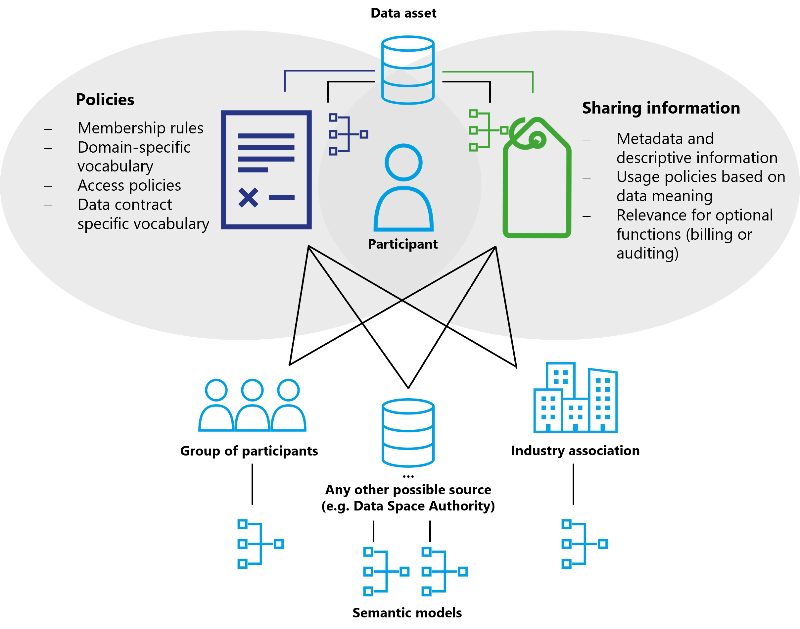

### Observability

In data spaces with highly regulated data, it is necessary to make the
data sharing process observable. This can be done for legal reasons to
prove that data has been processed only by authorized entities, or for
business reasons to provide a marketplace and billing function through a
trusted third party.

Depending on the architecture of the data space, multiple solutions are
possible. For a centralized architecture a central observer (sometimes
called clearing house, auditor or monitoring agent) can be implemented.
But this design has two shortcomings when implementing large-scale data
spaces: It presents an additional vulnerability that could affect the
sharing of mission critical data. And a central observer has data on all
DCAs which represents potentially valuable knowledge about the
participants. This can be exploited for financial gain, making it a
target for bad actors.

To address these risks, having at least a federated model of observers
is recommended to distribute the information, load, and potential for
error. To go a step further, a decentralized architecture can minimize
the risks associated with a centralized or federated observer model.

In a decentralized observer architecture, every participant keeps the
information about the agreed DCAs and their execution in their own
environment. Meaning that there are at least two copies of corresponding
logging information in the data space. The two copies can always be
identified through a correlation ID linking them. The observer then
matches the corresponding logging information and reports any
irregularities to the parties participating in the DCA (or to the
respective regulator if required).

A third party participant in the data space can have an additional VC
which qualifies them as a trusted observer, such as an industry auditor,
rooted in a governmental trust anchor for auditors.

To audit the contracts of a participant, the auditor would simply
request the log data which could then be published as data contract
offers with an access policy which restricts access to the auditor. To
verify the validity of those log entries, digital signing mechanism can
be used or the corresponding log data from other participants can be
requested (and again published as data contract offers). This would
limit access to sensitive observation data to observers that are
participants of the data space, have special credentials which qualify
them as trusted auditors and are bound to the policies of those
contracts due to the contracts on the collected log data. Observer
actions are automatically logged by the system and can be tracked and
monitored. This would enable a trust relationship in which auditors can
be audited by participants.

To simplify the observability of a data space, the DSGA can mandate that
participants make their audit data available as events or streams per
default. Then trusted auditors would not need to request publication but
could simply negotiate the relevant contracts, which are only accessible
to participants with valid auditing and monitoring credentials.

Following the same pattern, additional optional functional roles can be
implemented: a payment clearance service, notary services, regulatory
reporting, and the like.

### Vocabularies

Vocabularies are used to ensure that everyone means the same thing when
using a specific term. There are multiple vocabularies that are needed
in a data space, but two are particularly important:

- Semantic models for policies

- Semantic models of the shared data assets

So far, this document mostly described how a data space works, what
contracts are, what types of policies exist, and how to negotiate a
contract. The vocabularies describe the content of these elements.

The first category is the vocabulary of policies, which can exist on
multiple levels:

- Semantic model for policies for membership rules\
    For example, if a data space wants to restrict membership to
    companies with a HQ in certain countries. It must be clear what the
    policy is called and what values are allowed.

- Policies that each member of the data space must understand to
    interact with other participants. For example, policies that specify
    which industry vocabularies must be understood, and access policies.

- A participant can publish additional information on semantic models
    relevant for the interaction with this participant. This could be
    special access policies under which this participant publishes
    additional contracts. It could be an access policy that specifies
    access for direct suppliers of this participant.

- Data contract

- Semantic model which needs to be understood for a specific contract
    (e.g., special usage policy for a single contract)

The vocabularies for each level can be easily referenced by the metadata
publishing mechanism at the respective level. A data space can reference
the required policy vocabulary through its self-description. A
participant can also leverage its self-description to publish additional
vocabulary requirements. And at the data contract level, this
information can be easily stored in the metadata associated with the
contract at the catalog level.

For mandatory vocabularies a policy referencing them can be easily
established if such a policy model has been agreed upon.

Semantic models for data assets work on the same principle with the main
difference that they do not describe functionality of the data space
itself, but the meaning of the data being shared. If this data needs to
be understood to properly handle usage policies (e.g., if usage policies
are based on the meaning of data) it becomes an essential part to be
considered in the design of the data space. Semantic data models might
also be relevant for optional functions such as billing and auditing.

How best to manage the publication of vocabularies depends on the design
of the data space and its requirements. There can be central servers
hosting the semantic models, public semantic models from industry
associations that can be referenced externally, a group of participants
responsible for publishing and synchronizing common semantic models, or
semantic models that each participant receives when joining the data
space and which can be continuously updated through various
synchronization mechanisms.

### Optional functions

In addition to the functional elements of a data space, many optional
roles and components exist. The entities providing these functions must
join the data space like any other participant and fulfill all
requirements, policies and procedures enforced by the DSGA to establish
trust.

Depending on the services provided, these additional elements may need
to issue additional credentials, introduce additional trust anchors, or
require specific data contracts. There is a wide variety of optional
roles and services. Some especially useful ones are described here.

In general such optional functions can be distinguished as intermediary
functions or value-creating functions. Intermediaries can participate in
data spaces as value-creating services or functions.

**Intermediaries** are considered as optional in data spaces. Due to certain
regulations like the Data Governance Act, such intermediaries may require
additional governance.

**Value-adding services** may be realized by intermediaries or as function
of a data space participant. Such value-adding services are not subject
to the IDSA Rulebook, but are explained in the [DSSC Blueprint Version 1](https://dssc.eu/)
in more detail. The IDSA Rulebook provides a limited explanation below.

#### Marketplaces

Data sharing always takes place peer-to-peer in a data space with data
discovery being provided via catalogs. This basic functionality does not
cover any form of business model. Since many dataspaces require not only
searching for available data but also platforms for trading, buying, and
selling data, it is expected that many different models of data
marketplaces will emerge within data spaces.

Again, these can be centralized marketplaces, federated marketplaces, or
individual decentralized business platforms. Similar to how resources
can be bought and sold on exchanges, functions can be created for data
contracts. A marketplace can also provide a catalog that enables data
discovery as well as a business platform to buy and sell data. Or it
simply may act as a broker facilitating the negotiation of data
contracts for a fee.

#### Processing services

A data space can have participants that do not offer their data and are
not the end users of data. At its most basic level, these can be
participants that are offering algorithms and code for processing data
as a data contract to deliver code libraries, signed containers, or
entire virtual machines to other participants. For very computation
intensive or special hardware requiring workloads these participants
might offer their own infrastructure as part of the contract and use
policies to control the use of their resources.

Many data spaces can be built on top of the peer-to-peer model, such as
a data supply chain where data assets pass through multiple processors
before reaching the end user. The implementation and capability of these
services again depends on the architecture, policies, and rules of the
data space.

#### Data escrow, data trustee

For many applications, data assets and algorithms from multiple sources
need to be combined to generate value. This will lead to trusted service
providers collecting all necessary data, perform the calculations, and
then distribute the results - while adhering to all contract policies
and guaranteeing the execution of usage policies such as the enforcement
of deletion rules. The business model for these participants will be
only to provide trusted services and not to use the data.

Plenty of possible models are conceivable, from centralized, federated
to decentralized offerings with different technical capabilities, trust
levels and costs. Classic data aggregation platforms such as data lakes
can also be a possible implementation and benefit from the trust which a
data space provides.

## Technical components of a data space

### Data space governance authority services

Several services are required that represent the functional role of the
data space governance authority (DSGA) to enable the management functions of a data
space. These services may be designed as centralized, federated
(distributed) or decentralized services (See below for more information
on the differences between these solution designs). Depending on which
design is chosen, these services can be implemented with varying
component designs that best support the needs of the data space.

Regardless of the technical implementation and the specific architecture
model, the following components are required:

- Registration: A service providing the requirements of the data space
    to apply for membership (includes the validation of attributes and
    their values of the participant self-description and checking their
    applicability against membership policies). This service can be
    machine based but can also include human workflows.

- Membership credentials: a membership issuance and verification
    service can be used to manage membership credentials. Also
    responsible for revocation of credentials.

- Participant directory: Enables the discovery of other participants
    in the data space.

### Identity

The design of the identity provider is the first decision for the design
of the data space. If a central identity provider is chosen to manage
the identities for all participants, every other service depends on this
central verification, and decentralized designs are no longer fully
feasible.

Which mechanism to use to identify participants is the most fundamental
design decision. It impacts policies on autonomy and sovereignty as well
as technical solution architectures for other components of a data
space.

| **Identity System**       | **Advantages**            | **Disadvantages**        |
|--- |--- | --- |
| **Centralized identity**  | Simple management for DSGA | Low autonomy and sovereignty of participants |
|  | High degree of control for DSGA    | Single point of failure |
|  | Traditional, well-known technology stack | Single point of attack |
|  |  | Harder to manage for participants |
| **Decentralized  identities**       | Full autonomy and overeignty for participants | Complexity: DSGA management requires decentralized protocols |
|  | Low resourcing need for DSGA | Lower degree of control for DSGA |
|  | Easy to manage for participants | New and partially unfamiliar technology stack|
|  | Harder to attack |  |

### Catalog

The catalog component supports the search for available data contracts.
Information about data contracts can be exchanged between participants
without the use of a catalog by sending the offer directly via a
separate channel (e-mail, notification). A catalog will be a common
component to implement data discoverability. It can be implemented as a
managed service by one or more selected participants, hosted by the data
space governance authority, or operated in a fully decentralized fashion by every
participant that offers data contracts (see the visual representation of
various implementation designs of the DSGA above). The type of catalog
architecture used depends on the design of the data space as well as the
needs and capabilities of the participants.

Hybrid catalog models combining central and distributed catalogs with
individual decentralized catalogs are possible, but must be carefully
designed to avoid unnecessarily increasing the complexity of
participating in the data space.

#### Attributes & self-description

Attributes and self-description should always be available as verified
presentations. The exact serialization format and service endpoints
depend on the implementation of the data space and the trust anchors in
use.

### Connector

The connector forms the gateway for a participant to a data space. It
provides the necessary API endpoints for other participants to negotiate
data contracts and request the execution of a data contract. The
connector acts as an agent of the participant to the data space.

Which solution components are provided by the connector beyond the
contract negotiation and execution depends on the implementation design
of the data space.

### Observer

As described above, there is no specific technical component for an
observer as this is a role within the data space and not a component.
