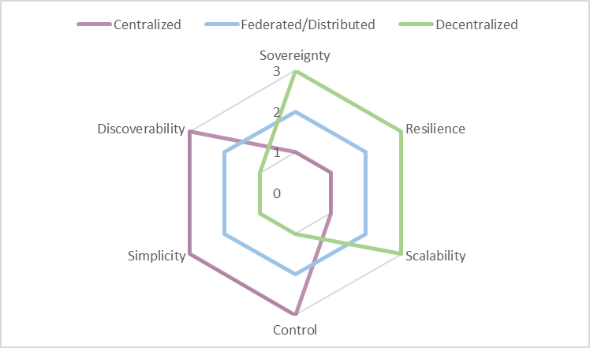

# Functional requirements for a data space

This section of the Rulebook describes the mandatory functional
requirements as well as optional elements for building trusted data
spaces. It highlights the design decisions necessary to build and
operate data spaces in centralized, federated or decentralized
architectures and deployment patterns to show how various solutions are
enabled by the building blocks of data spaces.

Enterprises strive to have control over their data. Control is important
when managing data internally, but even more in sharing data with
others. The core function of a data space is to broker trust between
participants and to negotiate available data contracts. They enable
control over data sharing and create value for all involved parties.

A data space is both a multi-organizational agreement and a supporting
technical infrastructure for data sharing. Participants can have
pre-existing levels of trust: Some may have a prior relationship and
trust each other, while others might have no relationship and are
untrusted entities. Data spaces even make data sharing between direct
competitors possible. Data space connectors facilitate and orchestrate
the sharing of data assets, while enforcing requirements set by the data
provider. A connector includes policies, configuration and other
metadata artifacts that can run on any cloud infrastructure, on premises
or on an edge device.

Data sharing in a data space is not limited to sending data from one
participant to another but can be more complex. Fundamentally, all
sharing of data consists of peer-to-peer interactions. All scenarios of
multiple actors are built on peer-to-peer data contracts of two
participants. A data space adds value beyond individual data transfers
by enabling collective data services and applications. These additional
capabilities require certain functional requirements to be included in
the design of a data space.

Different business, regulatory, legal, or technical requirements
necessitate different architectures and approaches. Some data spaces
might require centralized components with centralized control, while
others might be designed so their participants have a maximum level of
autonomy and maintain agency over how to share their data.

> The functional requirements section refers to all involved roles as
> 'participant' in a data space. This underlines the need for all parties
> involved in a data space and in the exchange, sharing, and usage of data
> to adhere to a common set of rules, the policies provided by the data provider,
> the rights granted by a data rights holder, and given regulations.
> 
> An overview on roles in a data space is given in [section 2 on guiding principles](./2_Guiding_Principles.md#role-models).

## Achieving digital sovereignty

Digital sovereignty starts with control over your identity.
Identification mechanisms are the basis for finding attributes of a
participant in a data space. Identity provides vital information to
enable the sharing of data -- everyone needs to understand who they are
sharing data with. It is the most important function within a data
space. It allows the participant to exert control, to choose which data
to share with whom, when and under what conditions. This ensures the
participant has agency over its assets.

How should the identities for participants be provided? A federated
system with a distributed design is a compromise between a centralized
and a decentralized design as it enables a higher level of control
without relying on a single central point of control. To enable a
federated system, services are implemented where multiple participants
share the responsibility for necessary functionality for all.

The data space governance authority (DSGA) is responsible for establishing the
policies and rules of the data space. This role can be carried out by
one entity, but also by multiple or even all participants. In a
centralized data space, this could be the operating company. In a
federated data space, this function would be performed by the
federator(s) agreeing on the rules, while in a fully decentralized data
space, various mechanisms are available to the participants. The
mechanisms in a decentralized data space enable participants to agree on
the set of policies and their enforcement, thus sharing responsibility
for the data space governance authority function.

When evaluating different data space architectures and deployment
models, the individual set of rules that serves as the basis is
important, regardless of the required services mentioned above. One such
rule set is the book of law for the membership. When a data space
operates in a regulated industry, there are laws and regulations for
data sharing. In this case, it makes sense to include specific
regulations in the data space policy and rule set. This provides clarity
when the data space crosses legal jurisdictions or industries.

## Foundational concepts of a data space

The foundational concepts of a data space:

- Establishing trust
- Data discoverability
- Data contract negotiation
- Data sharing & usage
- Observability
- Vocabularies and semantic models

Additional elements that support these main functions of a data space
can include these optional functional areas:

- Application and processing services
- Marketplaces
- Data trustee and escrow services
- Data incubation and service creation

### Establishing trust

Establishing trust is fundamental to a data space. To create value from
data, it needs to interact with other data and then supports decision
making. The different entities must trust each other - without trust,
data will not be shared. Data spaces can create context-specific trust
where trust did not exist before or where it is difficult to establish
-- for example between competitors.

#### Attributes & self-descriptions

When people build trust with each other, they evaluate attributes of the
other person: attributes that are immediately verifiable (e.g., a
language spoken) or attributes that require an external authority to
verify them (e.g., a passport). To build trust, these attributes are
matched against (personal) policies. If a sufficient number of policies
are met, trust is established. Based on the attributes that have been
evaluated, different levels of trust can be negotiated.

To create trust in a data space a very similar process is used. It is
necessary to evaluate attributes of participants and match them with the
requirements, policies and rules of the data space, the participants,
and individual data contracts.

A data space needs to define policies that specify what attributes an
applicant must meet to become a trusted participant. This is achieved
through a data space self-description (DSSD), that allows new members to
provide attributes in their participant self-description (PSD) in a
format that can be understood by the data space governance authority (DSGA).
Therefore, the DSSD must include a reference to a semantic model that
describes the acceptable policies, their names, the potential value, and
the format in which those values are accepted.

For example, one data space might require self-descriptions to be
expressed as verifiable presentations in a single presentation per
attribute, while another data space might require self-descriptions to
be expressed as one large file containing all information serialized as
JSON-LD for the attributes and corresponding signatures. While
participants might manage the values of the PSD through application
services which enable complex data management and a permissions system
for editing, these services must render the self-descriptions in the
desired format that each data space requires at an appropriate service
endpoint for that data space.

Trust in a data space needs to be rooted in one or more trust anchors
and trust frameworks. These are similar to mechanisms that citizens use
in their daily lives: The level of trust depends on the authority that
issues them, such as a department of traffic issuing drivers licenses or
a ministry of internal affairs handing out citizen ID cards. The
underlying process is verifying a specific attribute.

A trust anchor
is an entity that issues certifications about an attribute. The
accompanying trust framework is the set of rules imposed by the trust
anchor to comply with its policies. Only then is the applicant eligible
for its attribute verification. For example, a company must follow the
laws of the country it is based in to obtain a valid company registry ID
issued by its government.

Deciding which trust anchors and trust frameworks, and thus which rules
and procedures of issuing and validating attributes are used, is the
responsibility of the DSGA and of the participants of the data space.
Details can be found in the certification section. For the data space
functionality, the concepts of trust anchor and trust framework form the
basis for the attribute-based trust mechanism.

In order to use of the concepts described above, the DSSD needs to
contain information about which trust anchors and trust frameworks are
accepted as roots of trust. Is it a sovereign entity that is the sole
root of trust, or is it embedded in a larger ecosystem of external trust
anchors and trust frameworks? Based on this, a potential participant can
make the decision whether to trust the data space and its members or
not.

The DSGA is also responsible for issuing membership credentials. It
ensures that an appropriate mechanism is provided for identifying and
verifying membership. In a centralized data space this could be the
issuance of a data space specific identity to interact with other
members. In a largely decentralized architecture, it could be the
issuance of a tamper-proof credential, such as a W3C verifiable
credential (VC) which provides proof of the attribute of membership.

The DSGA also performs other functional roles not directly related to
building trust but necessary for the operation of a data space. These
are primarily the mandatory function of regulating the lifecycle of
membership (participant discoverability, issuing of membership
credentials, verification services for membership proofs), but also many
optional services like observability and auditing, brokering and
marketplaces, providing vocabularies or other services required by the
data space members.

The communities coming together in the data space needs to make
decisions for the setup. Whether a centralized DSGA is required, or a
more federated or even fully decentralized model is appropriate must be
reasoned over when the data space is founded, as these architectural
choices are very hard to change later. Where on this spectrum of
possibilities an optimal design for a data space can be found depends on
the context and purpose of the data space.

#### Policies

Policies ensure a trusted data ecosystem within a data space. They are
used at multiple levels and at almost any interaction point. The two
main policy groups that are central to the functionality of a data space
are access policies (which control access to contracts) and contract
policies (which control the contract terms and the usage of data). While
the use of policies can be expanded by custom design within a data space
there are several fundamental policy points that enable the operation
and are therefore essential to understand.

It is essential to use policies for attribute-based trust in a data
space. Which policies need to be mandatory depends on the design and its
requirements. One data space might require policies that reflect the
sensitivity of health data in an international setting, while another
data space will need to enforce policies for national energy regulation.
Therefore, data spaces must define their own policies and communicate
them clearly. Participants may always choose additional policies in
their data contracts to further restrict access and use.

In a centrally managed data space, the DSGA might simply define the
ontology of policies. In a decentralized data space, there might be an
additional negotiation protocol that enables participants to agree on
the policy for their interaction.

Policies generally express three possible restrictions: prohibitions,
obligations, and permissions. Constraints expressing a rule can be
combined into more complex rules, which then form the applicable policy.
For example, a group of data space participants may only allow access to
their data for participants who belong to the same industry association,
allow to process data under the condition only anonymized results are
produced, and then permits to share the results with a third party for
processing if they meet a set of ISO
standards.

As discussed above, the first line of policy defense is the membership
policies (MP) and rules required to join a data space. These policies
ensure that only companies with certain attributes they can verifiably
prove, can join. These could be policies that verify the applicant's
nationality, industry certification, membership in industry
associations, but also policies that would require human interactions
and complex workflows, such as a valid contract with the DSGA that must
be negotiated before an applicant can become a participant.

Once an applicant becomes a participant, the next set of policies
becomes relevant: access policies (AP). An AP defines which attributes
must be available to access data contracts. A participant that does not
have access to a specific data contract should also not be able to see
the contract offer in the catalog. Optional services, like a
marketplace, should adhere to this principle as well and only show items
based on matching access policies and participant attributes. In a
scenario where contract offers should be made visible to everyone, the
access policy can also be expressed as an empty policy, not triggering
any restrictions. From a functional perspective, an access policy always
needs to be present, even if it grants access to everyone. A common
scenario is policies that grant access to anyone within the data space
but hide the associated item from queries by non-members (in case the
catalog endpoint is publicly accessible).

Each participant can define such policies, whether providing or
consuming data. For example, a participant interested in data could
define a policy to see only data with a distinct proof of origin, and
participants offering data could restrict access to their data to
members of a certain jurisdiction. This is often referred to as provider
policy and consumer policy.

When a participant has access to a data contract offer (DCO) the next
set of policies comes into play. A DCO can have contract policies (CP)
that define what attributes are needed for a data contract agreement
(DCA). CPs review attributes that must be provided at the contract
negotiation. This could be as simple as ensuring that the participant
uses a specific encryption algorithm or software package -- both of
which could be verified with a technical handshake procedure (e.g.,
sending a piece of information and requesting the properly encrypted
version). A more complex attribute example involving human interaction
is the association of the data contract with a legal contract between
the two parties that typically occurs outside of the data space
processes. The negotiation of policies can be on the spectrum of 100%
machine-processable and immediate to a human workflow potentially taking
a long time.

A contract may also specify policies for the transport mechanism for the
data asset transmission: like requiring a protocol, specifying pull or
push of data, mandating a data sink in a specific geographic area and
other details.

CPs may also include usage policies (UP) that take effect after the data
is transmitted and control how the data can be used by the receiving
party. Depending on the value of the data, use cases, trust levels,
contracts in place and many more attributes, there are different
possibilities to enforce UPs which come at varying costs.

For data with low importance or data not under a specific legal
protection, it might be too expensive to build a system that guarantees
control - it may be sufficient to simply monitor data use and fall back
to a legal contract should misuse of the data be detected. Other data
might be very sensitive, legally regulated, or costly and require
stronger protection and higher technical costs.

When designing a data space and deciding which data to share, it is
important to understand the data's classification, and regulatory
controls to design not just the right policies but also to mandate the
appropriate level of technical components that ensure proper handling of
the data.
  
| **Example**  |    **ProtectionNeed** | **Explanation** |
| :------------| :--------------------: | :---------------|
| Public weather data | low | Some data sets are already publicly available and can be shared without enabling others to derive sensitive data about persons or business secrets. |
|  Shipping information | medium  | Some data are valuable and at large scale likely to be highly protection worthy as they can give insights into business relations and transactions. |
|  Personal health data |  high | Personal health data are highly protection worthy due to strong laws and potential danger to the individual in case of data misuse. |
| Machine operations data | high | Industrial data is also usually of high value due to the sensitive business information it represents.|

The atomic expressions of policies can be further broken down into a set
of restrictions against which machine-readable attributes can be
compared.

#### Attribute based trust

Establishing trust based on attributes is a control mechanism. A
participant's level of trust is determined by evaluating participant's
attributes, data contract, data asset, and environment attributes. This
evaluates the potential risk of sharing data with another participant.
This trust level is also based on the participant attributes, the
attributes of the data space and the attributes of the data shared in
the data space, as well as the applicable trust anchors and trust
frameworks. It can express complex rule sets that can evaluate many
attributes. There is no limit to the attributes that can be defined and
the expression of policy rules to evaluate those attributes.

Depending on the level of risk that can be tolerated for sharing an
asset, restrictions need to be put in place. The restrictions are
expressed through policies as described above. The proofs of adherence
to the policies and rules are expressed through the participant
self-description (PSD), as well as additional attributes that might be
provided by the participant outside the self-description (e.g., proof
that commercial contract for the data exists and that payment for the
data has been submitted).

Attributes can be atomic expressions (e.g., the other entity is a
participant of a specific industry association) or a set of multiple
atomic expressions (e.g., the other entity is under a specific
jurisdiction and the destination for the data transfer in a specific
country). Attributes can be compared to static values (e.g.,
jurisdiction = country) or to one another (e.g., both parties support
the same encryption algorithm).

Many situations will required attributes that are complex and might
require complex workflows that can include human intervention. It is not
possible to generally answer how to handle extended and complex
attributes. This is a question of the design of the data space and its
rules.

Attribute based trust provides a dynamic, context- and risk-aware trust
model, that enables precise control by including attributes from many
different information systems with customized rules. It allows
participants flexibility to build and use different implementations
based on their requirements.

#### Data space policies and rules

As introduced above, data spaces require membership policies (MP) as
first barrier to their data space. There must also be a trust basis to
prove compliance with the policy, and an appropriate mechanism to allow
each participant to verify that their counterpart is adhering to it.
Every data space must define what level of trust is the minimum for
members. Each participant can verify other participants membership
through a digital signature mechanism provided by the data space or
separately verify compliance with data space policies and rules as
needed (e.g., if especially sensitive data is shared, all relevant
policies and self-descriptions can be evaluated ad hoc to ensure the
necessary trust level). Additional trust frameworks (e.g., the Gaia-X
trust framework) can be used to provide additional compliance
mechanisms. The data space could even be its own trust anchor. The
participants decide whether to trust the DSGA and its trust anchors.

The first level at which policies take effect in a data space is the
membership level. The next level is the catalog: Every participant
should only see items in the catalog that match the permission resulting
from matching the participant's attributes to the access policies of the
catalog. A contract offer should only be visible to those participants
who have the right to access it, to minimize unintentional sharing of
information. During the negotiation process for a data contract, the
detailed policies of that contract will be applied. Some of those
policies may be fully evaluated at that time while others may not be
evaluated until later when the data transfer is made or after the data
has been received. We refer to these policies as contract policies (CP)
and highlight the sub-group of usage policies (UP) because of their
importance in data sharing.

It will be impractical for many data spaces to act as the root of trust
as they would need to provide the necessary service functions. (e.g.,
compliance service to verify external attributes). Also, many data
spaces will require multiple external roots of trust, whether for
regulatory purposes, legal requirements, or simply because of existing
trust in established organizations.

A key question of a data space is therefore which roots of trust are
considered acceptable and whether any should be rejected. Since this is
an attribute of the data space it can be expressed through the data
space self-description (DSSD) and its acceptance mandated by the
membership policies encoded in the DSSD.

Another element needs to be part of the DSSD - the mandatory policy
information model for the data space. Every data space needs to define
the vocabulary to ensure a common understanding of the meaning of the
policies. There might be different meanings to the same policy
expressions in different data spaces. Therefore, is has to be done
individually.

This shows how important the DSSD is for the interaction with the data
space functions and to clearly understand the context and risk factors
of the data space. A data space needs to have an identity -- not just to
be clearly identifiable for the participants and potential members, but
also because the identity is the root element to which the DSSD is tied.
As mentioned above, the decision on how the functional elements are
implemented and expressed through the functional role of the data space
governance authority is highly dependent on the needs of the data space and is the
most important decision to be made when designing a data space.

#### Participant information

Information about a participant must be discoverable and understandable
for other participants - also to enable a clear understanding of the
attributes of the participant. Therefore, a participant needs a
participant self-description (PSD) that follows a known format and
protocol, as well as an ontology that describes the semantics of the
attributes.

The format of the PSD can be defined through the DSGA and may be a part
of the membership policies for the data space. In many cases, the format
and ontology of the PSD also depend on the selected trust anchors and
trust framework. For example, a data space that wants to use Gaia-X as a
trust anchor and leverage its trust framework must understand the Gaia-X
self-description structure and the meaning of the Gaia-X
self-description attribute definitions. A data space might require
multiple self-description ontologies (e.g., one trust anchor specific
and one industry specific) which can lead to ambiguity or conflict of
definitions, which have to be resolved by the DSGA.

The technical representation and communication of the PSD may vary from
one data space to another and will be influenced or mandated by the
trust anchor(s). One trust anchor and its trust framework might require
attributes to be presented as verifiable presentations when queried,
while another might require the possibility to request a set of
attributes serialized in a specific resource description format, and a
third one might require that all attributes be made discoverable in a
database that's available to all members for query at any time.

Entities that are participating in multiple data spaces at the same time
must manage their self-description attributes in a way that reliably
keeps attributes up to date, but also filters which ones should be
available in which data space and serialized in which format. For larger
enterprises with complex roles and responsibilities related to the
information contained in the attributes, this might include approval
processes and audit functions to track value changes to sensitive
attributes exposed by the self-descriptions.

Information exposed through participant self-descriptions (PSD) is used
in many policy evaluations throughout the data space. A non-exhaustive
list of examples is:

- Information for the registration process to evaluate whether an
    applicant can become a participant.

- Matching participant attributes to access catalog policies to only
    show items this participant is permitted to see.

- Automated matching of attributes to policy requirements in the
    contract negotiation process.

Self-descriptions can also be used to convey purely technical
information about a participant. For example, at what address can
another participant communicate with its catalog or connector with this
participant, what encryption techniques are supported. Whether this
information is stored and distributed in the same way as the PSD is a
question of the data space design. A data space that is using
centralized components for all mandatory functions will not require a
per participant discovery mechanism, while a more decentralized design
will require some discovery functions that can be implemented through
the same mechanism as the PSD or possibly through separate protocols.

### Data space participation

Participation in a data space is based on fulfilling all the policies,
rules and procedures that are mandatory for membership. In its simplest
form, these may just be technical or automatically verifiable policies.
In more advanced cases, these can be more complex policies and rules
that potentially require lengthy workflows with human interaction to
verify eligibility to join a data space (e.g., a signed legal contract
with a central operating company, membership in industry associations).

The procedure to join a space will likely include the following steps
for the applicant (details can vary due to the design and purpose of the
data space):

1. Candidate discovers the data space and the corresponding DSSD\
    This can be achieved through human interaction, a website of the
    data space, finding the [DID](https://www.w3.org/TR/did-core/) of the data space in some registry
    or through automated discovery protocol of existing participants
    among other things.

2. Candidate reads the DSSD and receives information about the policies
    and rules of the data space, as well as technical configuration
    information for endpoints and protocols.

3. Candidate evaluates the policies and rules and prepares additional
    information needed for the requirements when applying for membership
    in the data space.

4. When all information and necessary proofs are collected the
    candidate applies for membership through the registry function of
    the DSGA. The technical implementation of the data space registry
    might vary based on the requirements.

5. The DSGA requests proofs for all policies. This might include VCs and
    proof of technical capabilities, but also workflows including human
    interaction (e.g., signing a membership contract).

6. Once all policies have been satisfactorily processed the DSGA issues
    a VC/ proof of membership and sends it to the candidate, moving them
    from applicant to participant.

7. The new participant sets up all the necessary technical components
    for participation in the data space.

7. The application process is complete,
    the participant can start interacting with other participants
    (sharing data, browsing the catalog(s) for data of others,
    negotiating data contracts).

### Creating a data space

After discussing how to join a data space the question is: How do you
create a data space? The answer depends again on the purpose of your
data space and the needs of its participants. Regardless of whether the
data space is organized in a centralized, decentralized, federated or
hybrid manner, common denominators and basic functionalities can be
found.

A data space establishes trust within a community to share data with
each other. The definition of community can be very broad. It might be a
tight knit, small community of one company and its suppliers, or a large
community with many participants. Some data spaces are created for a
narrow use case and purpose others for many use cases that are relevant
for a group of participants.

Many decisions need to be made when designing the data space, here some
of the more common ones:

- Is the membership closed to a small, known group or open to a larger
    range of participants?

- Do you want a central party with additional privileges (e.g.,
    exclusion of participants for bad behavior) or is the independence
    of the participants and their autonomy the most important design
    factor?

- What level of technical maturity is expected from the participants?

- What type of data is shared and for what purpose?

Answering these questions helps you make the design choices between
architectures and deployment patterns of data spaces.

Once all design decisions are made, the functional elements are planned:

- Rules: What behavior and skills (technical and organizational) are
    required?

- Policies: the participation rules expressed and verified in policies

- Membership certification: What mechanism is used to verify a
    membership?

- Participant registry: Where can participants see who is
    participating?

- Identity system: centralized or decentralized identities - control
    over participants

- Catalog(s): one central, multiple federated or individual
    decentralized catalogs?

Working through the above list of mandatory functional elements will
clarify the architecture pattern for the data space, which will also
mandate a specific design of the data space governance authority. Now the DSGA needs
to be implemented to create the data space:

1. Create an identity for the data space
2. Provide a self-description

  - Membership policies
  - Trust anchors and trust frameworks
  - Attributes that will help participants decide which level of
        trust to apply for
  - use of the technical components as required according to the design
  - Participant registry
  - Registration service
    - Provide the workflow to apply for membership
    - Validate whether applicants comply with membership requirements
    - Issue membership credentials
    - Revoke membership credentials

3. Provide a discovery mechanism for the data space (website, contact
    form, etc.)

Once the DSGA is instantiated, organizations can apply for membership.
After a participant joins, there are two main activities that all
participants are interested in: discovering data shared by others and
sharing their own data in a controlled manner to ensure autonomy and
agency over the data. This is the core functionality that any data space
provides. Additional functions and services such as marketplaces, data
escrow services, processing services and applications might be provided
as optional elements.

### Data discovery

Regardless of the architectural design of the data space, the most used
function is the discovery of data shared by other participants. While
the detailed technical mechanisms vary for each implementation and
design, there are several common functional elements that are mandatory
for all implementations.

### Catalog(s)

Sharing data among participants requires the provision of metadata --
regardless of the design of the data space (centralized, federated, or
decentralized) and whether the data is open or protected. Information
about the data needs to be published with an agreed-upon vocabulary for
querying and with controls that regulate access to the catalog items.

Two participants can share data directly communicating off- or online
without the need for a catalog. But for more participants a catalog
function greatly increases the discoverability of data assets and
services. If there is more than one catalog due to a federated or
decentralized design, the catalog must allow federated searches of data
assets in catalogs at multiple sites.

Catalogs don't provide the data asset itself, but they provide data
contract offers (more on this in the section on data sharing below).

When choosing a target architecture for a data space, the design of the
catalog function can fall somewhere along the spectrum between a central
catalog, multiple federated catalogs, and many decentralized catalogs.
Each has its own advantages and disadvantages. Compare the three main
types of catalogs, depending on the implementation design of the DSGA, to
evaluate their capabilities:

| **Catalog architecture** | **Advantages**           | **Disadvantages**         |
| ---                  |   ---                | ---|
| **Centralized catalog**  | No deployment by individual participants   | A central gatekeeper can arbitrarily exclude participants and their data from the catalog  | 
|  | Central control – a gatekeeper can regulate which entries are permissible and which are not | Single point of failure  |
| | Easy discovery as only one catalog needs to be queried | Potential performance bottle neck |
|  |  | Security issues will affect all members at once |
| **Federated catalog** | Deployment by a limited number of participants, while most participants don’t need to deploy any catalog components | Additional replication mechanisms are needed |
|  | Federated control – voting mechanisms for content control can be implemented | A small group of operators of federated catalog nodes can control participation in the data space |
| **Decentralized catalog** | Every participant can autonomously decide which catalog items they share with whom | Every participant needs to run a catalog component |
|  | No interference in the interaction between two participants through a 3rd party | A list of available catalogs needs to be either centrally provided through the DSGA or discoverable through a peer-to-peer protocol |
|  | Data Space as a whole is more resilient towards cyberattacks even though individual members can experience outages | Participants need to crawl each other’s catalogs to see which items are available |
|  | Easier to scale |  |

#### Access policies

A best practice of access security is for an IT system to show users
only what they need to know - to minimize the potential attack surface.
The same is true for data contract offers (DCO) in a data space:
Participants should only see the DCOs for which they are authorized to
request a contract negotiation. This does not imply that the participant
already has authorization for the data but only that a participant is
allowed to see that the data exists. The permission to access is part of
the data contract negotiation. Any catalog must implement
attribute-based access control (ABAC) through access policies.

The most common access filter is that a participant proves membership to
see which assets are in a data space. Filters can also be applied that
make data assets accessible only to specific participant groups. For
example, a participant who has a VC as a data space member, but also has
an additional VC which attests that the participant is an auditor, could
provide this participant access to audit log files or streams which are
being shared as DCOs, but should not be visible to participants without
the special auditor credentials.

In case a participant wants to make a DCO visible to other entities that
are not participating in the data space and are merely using the
technical mechanisms of the data space or have been directly informed
about the existence of those DCOs, they could have an access policy
which is simply a no-op, or allow-all policy.

Access policies can also be used as filters to control visibility/access
to DCOs. For example, time-based policies can be used to control when
DCOs can be negotiated, location-based policies can limit the audience
to participants from a specific geographic region.

### Data sharing

Once a participant has joined a data space and discovered available data
contract offers, the mechanism of data sharing is initiated. Data
sharing is the core activity to enable further data processing and value
generation by using the data.

Data sharing is a very broad term in this context. It ranges from a
one-time transfer of a file, access to an API, registering for an
eventing service, subscribing to a data stream, also including data
sharing methods where the data remains at the source and algorithms and
processing code are copied to the data location for in-place processing.
Data Sharing does not require a physical move of the data asset,
although this will be frequently the case.

However, before data can be shared, a data contract offer needs to be
negotiated to reach a data contract agreement (DCA) which specifies all
policies and details of the data sharing process.

#### Contract negotiation

A contract negotiation (CN) serves the purpose of reaching an agreement
to share a data asset between two participants of the data space. During
the CN policies of the DCO are evaluated against the attributes of the
requesting participant, and VCs are verified with their issuers. Note
that while any trust anchor is an issuer of VCs that can be used to
evaluate policies, there might be additional external issuers that need
to be validated (e.g., government agencies, regulators, industry
associations)

It is important to note that the CN does not automatically lead to an
immediate data or algorithm transfer. The result of a CN is a data
contract agreement, which then can be executed at a later point in time.

Imagine a scenario where multiple roles are involved in the process of
data sharing in a large enterprise. The person negotiating the DCA might
not be the same one who is responsible for sharing the data. Or there
might be data assets that can't be immediately shared after the
agreement is reached (e.g., an event notification that can only be
consumed until the event in questions has occurred).

**Data sharing execution**

When it is time to share the data, it might be necessary to re-validate
the policies of the data contract agreement as significant time might
have passed since the contract negotiation. The decision whether to
revisit all policies might depend on each party's business rules. If
data needs to be highly protected or requires specific regulatory
processes for handling it, it is advisable to conduct an additional
review.

To exercise a data contract agreement (which could also be code to
process data), data needs to be moved from one participant to another.
This can be done either by a push model in which the participant with
the data asset pushes the data to the other participant or by a pull
model, in which the data asset is made available to the consuming
participant via a link.

The data transfer technology depends on the type of data asset, trust
level, availability of technical protocols, infrastructure environment,
and other factors. All data transfer technologies must be able to be
orchestrated. Orchestration at this level means having technical control
over the data sharing process, allowing the connector to start and stop
the transfer, as well as having the necessary technical capabilities to
monitor the progress of the transfer and to receive information about
compliance with usage policies.

The transfer itself needs to ensure security, performance, and
manageability. For example, a data stream can be provided from multiple
data centers to enable a highly available data sharing architecture.

When data is not moved but a "code to data" approach is selected, the
push and pull behavior is reversed: The consumer participant provides a
data asset containing code (source code, compiled library, signed
container) to the participant providing the data. This can be
implemented like any other data asset transfer with a push or pull
mechanism.

Data sharing must accommodate a wide range of scenarios. From a simple
file transfer between two storage providers, to API access for streaming
or eventing, to quite complex implementations with secure execution
environments through confidential compute enclaves, environment
attestations, signed code, custom encryption algorithms, and more. Which
solution is right depends on the protection needs of the data and the
trust level between the participants.

The transfer technology can be specified as a policy in the data
contract agreement, or it can be implicitly inferred by the type of data
asset being shared. A participant who wants to ensure that data never
leaves an environment where full control over its usage is guaranteed
can enforce the selection of the transfer technology and storage and
processing infrastructure by setting policies in the contract and
monitoring compliance.

### Observability

In data spaces with highly regulated data, it is necessary to make the
data sharing process observable. This can be done for legal reasons to
prove that data has been processed only by authorized entities, or for
business reasons to provide a marketplace and billing function through a
trusted third party.

Depending on the architecture of the data space, multiple solutions are
possible. For a centralized architecture a central observer (sometimes
called clearing house, auditor or monitoring agent) can be implemented.
But this design has two shortcomings when implementing large-scale data
spaces: It presents an additional vulnerability that could affect the
sharing of mission critical data. And a central observer has data on all
DCAs which represents potentially valuable knowledge about the
participants. This can be exploited for financial gain, making it a
target for bad actors.

To address these risks, having at least a federated model of observers
is recommended to distribute the information, load, and potential for
error. To go a step further, a decentralized architecture can minimize
the risks associated with a centralized or federated observer model.

In a decentralized observer architecture, every participant keeps the
information about the agreed DCAs and their execution in their own
environment. Meaning that there are at least two copies of corresponding
logging information in the data space. The two copies can always be
identified through a correlation ID linking them. The observer then
matches the corresponding logging information and reports any
irregularities to the parties participating in the DCA (or to the
respective regulator if required).

A third party participant in the data space can have an additional VC
which qualifies them as a trusted observer, such as an industry auditor,
rooted in a governmental trust anchor for auditors.

To audit the contracts of a participant, the auditor would simply
request the log data which could then be published as data contract
offers with an access policy which restricts access to the auditor. To
verify the validity of those log entries, digital signing mechanism can
be used or the corresponding log data from other participants can be
requested (and again published as data contract offers). This would
limit access to sensitive observation data to observers that are
participants of the data space, have special credentials which qualify
them as trusted auditors and are bound to the policies of those
contracts due to the contracts on the collected log data. Observer
actions are automatically logged by the system and can be tracked and
monitored. This would enable a trust relationship in which auditors can
be audited by participants.

To simplify the observability of a data space, the DSGA can mandate that
participants make their audit data available as events or streams per
default. Then trusted auditors would not need to request publication but
could simply negotiate the relevant contracts, which are only accessible
to participants with valid auditing and monitoring credentials.

Following the same pattern, additional optional functional roles can be
implemented: a payment clearance service, notary services, regulatory
reporting, and the like.

### Vocabularies

Vocabularies are used to ensure that everyone means the same thing when
using a specific term. There are multiple vocabularies that are needed
in a data space, but two are particularly important:

- Semantic models for policies

- Semantic models of the shared data assets

So far, this document mostly described how a data space works, what
contracts are, what types of policies exist, and how to negotiate a
contract. The vocabularies describe the content of these elements.

The first category is the vocabulary of policies, which can exist on
multiple levels:

- Semantic model for policies for membership rules\
    For example, if a data space wants to restrict membership to
    companies with a HQ in certain countries. It must be clear what the
    policy is called and what values are allowed.

- Policies that each member of the data space must understand to
    interact with other participants. For example, policies that specify
    which industry vocabularies must be understood, and access policies.

- A participant can publish additional information on semantic models
    relevant for the interaction with this participant. This could be
    special access policies under which this participant publishes
    additional contracts. It could be an access policy that specifies
    access for direct suppliers of this participant.

- Data contract

- Semantic model which needs to be understood for a specific contract
    (e.g., special usage policy for a single contract)

The vocabularies for each level can be easily referenced by the metadata
publishing mechanism at the respective level. A data space can reference
the required policy vocabulary through its self-description. A
participant can also leverage its self-description to publish additional
vocabulary requirements. And at the data contract level, this
information can be easily stored in the metadata associated with the
contract at the catalog level.

For mandatory vocabularies a policy referencing them can be easily
established if such a policy model has been agreed upon.

Semantic models for data assets work on the same principle with the main
difference that they do not describe functionality of the data space
itself, but the meaning of the data being shared. If this data needs to
be understood to properly handle usage policies (e.g., if usage policies
are based on the meaning of data) it becomes an essential part to be
considered in the design of the data space. Semantic data models might
also be relevant for optional functions such as billing and auditing.

How best to manage the publication of vocabularies depends on the design
of the data space and its requirements. There can be central servers
hosting the semantic models, public semantic models from industry
associations that can be referenced externally, a group of participants
responsible for publishing and synchronizing common semantic models, or
semantic models that each participant receives when joining the data
space and which can be continuously updated through various
synchronization mechanisms.

### Optional functions

In addition to the functional elements of a data space, many optional
roles and components exist. The entities providing these functions must
join the data space like any other participant and fulfill all
requirements, policies and procedures enforced by the DSGA to establish
trust.

Depending on the services provided, these additional elements may need
to issue additional credentials, introduce additional trust anchors, or
require specific data contracts. There is a wide variety of optional
roles and services. Some especially useful ones are described here.

In general such optional functions can be distinguished as intermediary
functions or value-creating functions. Intermediaries can participate in
data spaces as value-creating services or functions.

**Intermediaries** are considered as optional in data spaces. Due to certain
regulations like the Data Governance Act, such intermediaries may require
additional governance.

**Value-adding services** may be realized by intermediaries or as function
of a data space participant. Such value-adding services are not subject
to the IDSA Rulebook, but are explained in the [DSSC Blueprint Version 1](https://dssc.eu/)
in more detail. The IDSA Rulebook provides a limited explanation below.

#### Marketplaces

Data sharing always takes place peer-to-peer in a data space with data
discovery being provided via catalogs. This basic functionality does not
cover any form of business model. Since many dataspaces require not only
searching for available data but also platforms for trading, buying, and
selling data, it is expected that many different models of data
marketplaces will emerge within data spaces.

Again, these can be centralized marketplaces, federated marketplaces, or
individual decentralized business platforms. Similar to how resources
can be bought and sold on exchanges, functions can be created for data
contracts. A marketplace can also provide a catalog that enables data
discovery as well as a business platform to buy and sell data. Or it
simply may act as a broker facilitating the negotiation of data
contracts for a fee.

#### Processing services

A data space can have participants that do not offer their data and are
not the end users of data. At its most basic level, these can be
participants that are offering algorithms and code for processing data
as a data contract to deliver code libraries, signed containers, or
entire virtual machines to other participants. For very computation
intensive or special hardware requiring workloads these participants
might offer their own infrastructure as part of the contract and use
policies to control the use of their resources.

Many data spaces can be built on top of the peer-to-peer model, such as
a data supply chain where data assets pass through multiple processors
before reaching the end user. The implementation and capability of these
services again depends on the architecture, policies, and rules of the
data space.

#### Data escrow, data trustee

For many applications, data assets and algorithms from multiple sources
need to be combined to generate value. This will lead to trusted service
providers collecting all necessary data, perform the calculations, and
then distribute the results - while adhering to all contract policies
and guaranteeing the execution of usage policies such as the enforcement
of deletion rules. The business model for these participants will be
only to provide trusted services and not to use the data.

Plenty of possible models are conceivable, from centralized, federated
to decentralized offerings with different technical capabilities, trust
levels and costs. Classic data aggregation platforms such as data lakes
can also be a possible implementation and benefit from the trust which a
data space provides.

## Technical components of a data space

### Data space governance authority services

Several services are required that represent the functional role of the
data space governance authority (DSGA) to enable the management functions of a data
space. These services may be designed as centralized, federated
(distributed) or decentralized services (See below for more information
on the differences between these solution designs). Depending on which
design is chosen, these services can be implemented with varying
component designs that best support the needs of the data space.

Regardless of the technical implementation and the specific architecture
model, the following components are required:

- Registration: A service providing the requirements of the data space
    to apply for membership (includes the validation of attributes and
    their values of the participant self-description and checking their
    applicability against membership policies). This service can be
    machine based but can also include human workflows.

- Membership credentials: a membership issuance and verification
    service can be used to manage membership credentials. Also
    responsible for revocation of credentials.

- Participant directory: Enables the discovery of other participants
    in the data space.

### Identity

The design of the identity provider is the first decision for the design
of the data space. If a central identity provider is chosen to manage
the identities for all participants, every other service depends on this
central verification, and decentralized designs are no longer fully
feasible.

Which mechanism to use to identify participants is the most fundamental
design decision. It impacts policies on autonomy and sovereignty as well
as technical solution architectures for other components of a data
space.

| **Identity System**       | **Advantages**            | **Disadvantages**        |
|--- |--- | --- |
| **Centralized identity**  | Simple management for DSGA | Low autonomy and sovereignty of participants |
|  | High degree of control for DSGA    | Single point of failure |
|  | Traditional, well-known technology stack | Single point of attack |
|  |  | Harder to manage for participants |
| **Decentralized  identities**       | Full autonomy and overeignty for participants | Complexity: DSGA management requires decentralized protocols |
|  | Low resourcing need for DSGA | Lower degree of control for DSGA |
|  | Easy to manage for participants | New and partially unfamiliar technology stack|
|  | Harder to attack |  |

### Catalog

The catalog component supports the search for available data contracts.
Information about data contracts can be exchanged between participants
without the use of a catalog by sending the offer directly via a
separate channel (e-mail, notification). A catalog will be a common
component to implement data discoverability. It can be implemented as a
managed service by one or more selected participants, hosted by the data
space governance authority, or operated in a fully decentralized fashion by every
participant that offers data contracts (see the visual representation of
various implementation designs of the DSGA above). The type of catalog
architecture used depends on the design of the data space as well as the
needs and capabilities of the participants.

Hybrid catalog models combining central and distributed catalogs with
individual decentralized catalogs are possible, but must be carefully
designed to avoid unnecessarily increasing the complexity of
participating in the data space.

#### Attributes & self-description

Attributes and self-description should always be available as verified
presentations. The exact serialization format and service endpoints
depend on the implementation of the data space and the trust anchors in
use.

### Connector

The connector forms the gateway for a participant to a data space. It
provides the necessary API endpoints for other participants to negotiate
data contracts and request the execution of a data contract. The
connector acts as an agent of the participant to the data space.

Which solution components are provided by the connector beyond the
contract negotiation and execution depends on the implementation design
of the data space.

### Observer

As described above, there is no specific technical component for an
observer as this is a role within the data space and not a component.

### Vocabulary

The semantic model for the policies and self-descriptions required to
join the data space is provided by the DSGA. It may also provide semantic
models that need to be understood throughout the data space and might be
mandatory for the publication and use of specific data contracts.

The DSGA must decide how semantic models are provided, whether by
reference to a known, standardized schema externally or through a
vocabulary service provided by the DSGA or specific participants.

Individual participants may provide additional vocabulary services to
enable the discovery of semantic models needed to successfully share
data with that participant. These could be additional semantic policies
or semantic models that describe the shared data model. For example, the
semantic model of the shared data must be understood by the consumer to
properly manage consent for GDPR.

As mentioned before, the importance of the implementation design of the
DSGA and the components of a data space cannot be emphasized enough. The
implications for autonomy, sovereignty, reliability, security, and many
other factors are far reaching, so the decision on the design needs to
be made with utmost care.

### "Central," or "federated/distributed," or "decentralized"

#### Centralized data space governance authority

In a centralized DSGA design, the entity runs all services to operate the
data space. These include services to identify participants, onboard new
participants, manage memberships, provide semantic models, discover data
and optional services like marketplaces and audits.

While this model is popular due to the familiarity with centralized
models through existing aggregator platforms, it limits the autonomy and
sovereignty of participants. If a centralized identity provider is used,
the entity that controls the identity provider also controls membership
and access to resources. This entity could make arbitrary decisions on
inclusion or exclusion without regard to the policies of the data space.
Worst case, such a central identity service could interfere with the
data sharing between two participants, with serious consequences beyond
the data space.

A central catalog has advantages for data discovery as it provides a
known location to discover available data and queries only need to be
made at one endpoint and data contract offers are returned from multiple
participants. But it poses the risk that the entity controlling the
catalog also controls its content and make arbitrary decisions which
items are available to whom.

Centralized services also create a single point of failure. Outage could
result in the entire data space becoming unavailable or inoperable. This
could cause a significant business risk for participants.

If the data shared is valuable data that should be highly protected, it
could attract bad actors trying to gain access, manipulate it or simply
disrupt operations to harm their targets. When a lot of value is
aggregated into a centralized component, it could become the target. An
infiltrated central identity provider or catalog could create more
damage than if a single participant is attacked.

With careful planning and the right choices when implementing a
centralized data space, many of the issues that can prevent participant
autonomy can be avoided or softened. But vital functional resources of
the data space do not allow for full autonomy of participants in this
design solution. However, depending on the purpose and goals of the data
space this may not be a problem.

#### Federated / distributed data space governance authority

The federated or distributed model retains some degree of centralized
control but improves on the technical and security challenges. In this
model, functional roles are distributed to a few federated nodes.
Instead of just one entity providing a service, multiple entities share
responsibility for providing this service through individual nodes that
are synchronized. This requires some additional technical investment as
nodes need to be synchronized, transactions handled, and queries
performed across multiple services.

While this model strongly improves resilience and availability, it also
increases complexity. Some functional roles are more complex to
implement in a distributed environment (e.g., identity) than others
(e.g., catalog). However, it offers interesting variations on the
centralized design by allowing more sophisticated designs. For example,
a federated catalog could be implemented so that different sub-catalogs
are available on different nodes, instead of synchronizing all entries
everywhere, increasing performance and availability of the system.

If the goal of the data space is to maximize participant sovereignty and
autonomy, the distributed model does not provide significant
improvements in comparison to the centralized design because a small
group of entities would have most control over the data space and the
participants would be almost as dependent on these entities as in a
centralized data space.

Nevertheless, a federated model can be the optimal solution to implement
data spaces based on closed group consortia with clear consortia
leaders. There may be reasons beyond the technical design, such as
contracts and legal regulations that necessitate implementing a data
space as a federated or partially federated model.

When talking about distributed data spaces there is a distinction
between "*Federation service"* and *"Federated service".*

- Federation service supports the federation functionality of a data
    space and serves a functional role such as identity or catalog.

- Federated service describes the implementation of any service as a
    distributed service in a data space, including but not limited to
    any of the federation services.

To maximize the sovereignty and autonomy of participants in a data
space, every participant must be free to act without being improperly
impeded by anybody. A participant must follow the rules and adhere to
policies, but a sovereign participant needs to be immune from undue or
random interference. Improper interference can include refusal to put a
participant's data assets in the catalog despite meeting all
requirements or deactivating the participants identity and thus
potentially disrupting the participant's business. This may not be
malicious interference; errors can happen, and the software could be
unstable. A fully sovereign participant must be able to interact with
other participants without depending on a third party once it is proven
that the participant is following all rules.

#### Decentralized data space governance authority

Using a decentralized design enables the highest level of autonomy and
sovereignty. The core element enabling a participant to act autonomously
is the identity system. By using a decentralized identity system each
participant is responsible to maintain identity information that can be
verified by other participants or the DSGA, rather than relying on a
centralized identity provider.

Once decentralized identities are established, all other functional
services can also to be decentralized, minimizing or even eliminating
barriers to participant sovereignty.

It should be noted that in a decentralized data space a lot of the
responsibility for operating essential functional roles shifts from the
DSGA to the participants. For example, in a centralized model, the DSGA is
expected to operate the catalog of available data assets, while in a
decentralized model, each participant is responsible for publishing its
available data directly and in turn, each participant needs to ask all
other participants about their available assets.

Another advantage of a decentralized system is that it is usually more
resilient to errors or bad actors, since problems in individual nodes do
not automatically affect all participants of the data space. Finally, a
decentralized system does not require an ever-increasing number of
centralized services. Each node is self-contained and provides all the
endpoints necessary to interact with it. A data space can grow and scale
much more efficiently than a centralized design, where the resources to
provide central services must grow exponentially.

### Decision areas

#### Sovereignty

The goal of digital sovereignty is autonomy, which is different from
independence -- it means acting with choice. It includes control over
when and where data is stored and how it can be accessed. Sovereignty
and autonomy are not binary concepts but move along a spectrum. The goal
is to increase sovereignty and autonomy until a desired threshold is
reached. In that sense, the concept is similar to that of privacy.

#### Resilience

Resilience in a data space is about the ability of the ecosystem and
individual actors to continue functioning in the event of unforeseen
problems.

#### Scalability

Scalability of a data space is not about the volume of data but about
the number of participants, the amount of the data assets shared, and
the number of negotiated contracts.

#### Control

In this context, a high level of control means that the entity operating
the DSGA can control access to the services as well as the content they
provide. This is in direct contrast to sovereignty, where the control
lies with the individual participant.

#### Simplicity

Well-established technologies and architecture models are easier to
deploy because implementing teams have experience with them. The
interaction model between participants as well as the business model of
the data space are included in this category.

#### Discoverability

Discoverability is the measure of how many steps are necessary to find
the data offered in the data space. Since data asset information can
always be exchanged directly between participants, this measure only
considers how complex a query would be to find all data assets currently
offered in the data space.

### Decision support

As all decision areas are connected and partially work against each
other, it is necessary to look at them holistically and not focus on one
area. Make sure you weigh the importance of these decisions according to
your business and technical needs. The technical maturity of the planned
participants is an important factor. Many organizations are willing to
compromise on their digital sovereignty in exchange for convenience and
business value.

Many models exist in between the main three implementation designs. The
following charts highlight some of the interdependencies between the
decision areas for planning, implementing and operating a data space:

With a centralized design the entity operating identity and catalog
services has a lot of control. It is easy to setup, only one entity
needs to deal with the DSGA services, and participants can simply query
one catalog and rely on the DSGA as a trust anchor to issue a participant
ID. But this design impairs participant sovereignty, is less resilient
and difficult to scale as the central services will grow exponentially
in their resource requirements as more participants join.

The distributed design sits in the middle of the spectrum. Control is
not exercised by a single entity but by multiple federators and thus not
a single entity can make arbitrary decisions. However, participants
still do not have full control over their actions, so sovereignty is
still impaired. Resilience and scalability are improved by having
multiple nodes of the data space services that can either be setup as
partitions or as replicas. Discoverability must take into account the
partitioning of the catalog and might become more complex.

The aim of the decentralized design is to maximize the sovereignty of
individual participants and grant them as much autonomy as possible.
This reduction in dependency on central services automatically leads to
higher resilience and better scalability. However, it adds complexity
for the individual participant, as all participants now need to operate
service nodes that participate in the discovery process of available
data. Some data spaces might require additional control over
participants and their actions, which is harder to achieve in a
decentralized implementation.

The figure below gives a comprehensive overview of the values within the
decision areas when implementing a centralized, federated/distributed,
or decentralized approach.

Another way to compare the features and
capabilities of the different designs is to separate the decision areas
into a business and a technical perspective. Which design benefits the
business value of the data space vs. which design aspects are a
technical necessity? A careful compromise design-decision can be voted
on by the founding parties of the data space to reach the optimal
implementation.

These three models are just examples of possible implementation designs.
Every data space should be tailored to the needs of its participants.
Any entity that wishes to participate in a data space should investigate
the implementation design in detail to ensure the design grants them the
aspired level of sovereignty and supports its business goals.
