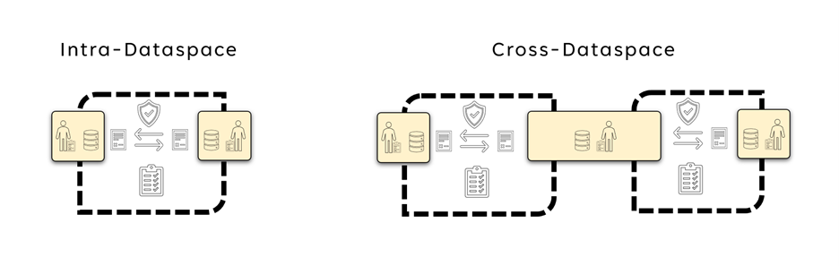
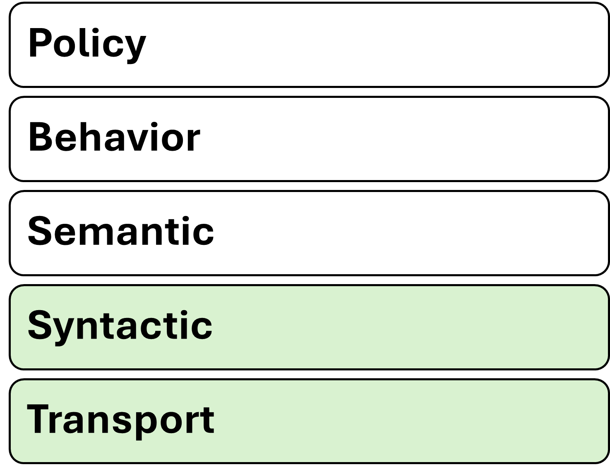
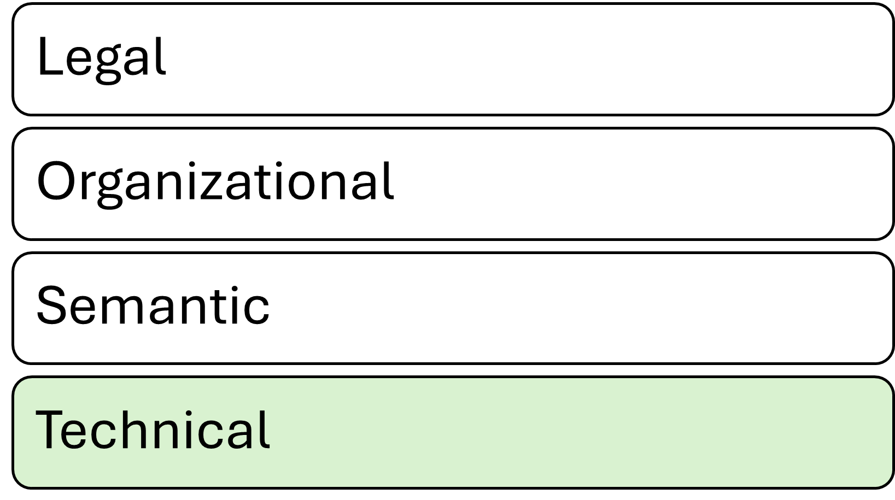

# Data Spaces Interoperability - How to achieve Interoperability within a Data Space and across multiple Data Spaces

## Motivation for interoperability

Data is one of the most valuable assets in the digital economy, but its
potential value can only be realized if it can move and interact with
other data to produce insights that create value. For this it must be
possible for data to be shared and reused in a trusted way.
Interoperability, the ability of different systems and organizations to
exchange, understand and use data, is essential for enabling data
sharing and creating value in data ecosystems. Data Spaces help to
establish a common understanding of trust, provide a mechanism to
establish sharing contracts, which include access and usage policies
that ensure the protection and accountability of data providers and data
consumers. As Data Spaces become more prevalent and diverse, there is
also a growing need for intra- and cross-Data Spaces interoperability.

Different Data Spaces may have different goals, architectures, business models, and governance structures, depending on
the authority or community that drives them. To avoid
fragmentation and duplication of efforts, participants in these
Data Spaces need to communicate in an interoperable way with each other
and across multiple Data Spaces, following common standards and
principles.

Interoperability can be achieved at different levels, depending on the
degree of integration and alignment of the data and systems involved.
Two well-known frameworks that define interoperability levels are the
[ISO/IEC
19941](https://standards.iso.org/ittf/PubliclyAvailableStandards/c079573_ISO_IEC_19944-1_2020(E).zip)
standard for cloud computing interoperability and portability, and the
European Interoperability Framework for public services. Both frameworks
identify four main levels of interoperability: technical (transport &
syntactic), semantic, organizational, and legal:

- Technical interoperability refers to the physical and logical
    connections between systems and data sources, such as protocols,
    interfaces, and formats. This includes syntactic interoperability
    which refers to the structure and syntax of the data exchanged, such
    as schemas, models, and vocabularies.

- Semantic interoperability refers to the meaning and interpretation
    of the data, such as concepts, relationships, and ontologies.

- Organizational interoperability refers to the processes, policies,
    and governance of data sharing, such as roles, responsibilities, and
    agreements.

- Legal interoperability refers to the acceptance of legal equivalence
    of contracts and contractual clauses between different data
    ecosystems. These ecosystems can have differences on multiple
    dimensions, based for example on industry regulations, or national
    laws but also contractual statements with identical wordings might
    have diverging interpretations in different data ecosystems.

In this chapter, we discuss the challenges and opportunities of
achieving cross- and intra- Data Space interoperability at these levels,
and propose a roadmap for developing a common framework and best
practices for Data Spaces.

## Guiding principles for Data Spaces

As described in the previous sections, there are [guiding principles,(https://docs.internationaldataspaces.org/ids-knowledgebase/v/idsa-rulebook/idsa-rulebook/2_guiding_principles)] in
Data Spaces that are not only shaping the [functional requirements,(https://docs.internationaldataspaces.org/ids-knowledgebase/v/idsa-rulebook/idsa-rulebook/3_functional_requirements)], but
also take effect in reasoning over interoperability. Those guiding
principles are the foundation of any interoperability framework for
Data Spaces. Let's have a closer look at those fundamental principles
again:

1. Self-determined control of data use (Data Sovereignty as also part of [ISO/IEC CD TS 10866, Framework and concepts for organizational autonomy and digital sovereignty](https://www.iso.org/standard/83757.html) ) is of
    utmost importance and should be the ideal vision that each Data Space
    thrives to enable.

    1. Participants have autonomy and are able to act with choice

    2. Participants have agency over their data assets

2. A Data Space creates a context of trust

3. The Data Space Governance Authority is a governance body for a
    Data Space

To better understand the model above we need to understand Data Spaces
differently at different layers. There is a legal layer where a
Data Space is governed by legal contracts to join a consortium which is
responsible for the Data Space. This can be a not-for-profit organization
where participants join as members to jointly agree on what the rules of
the Data Space are, but also can be driven by a single entity which
dictates the rules of the Data Space. Both models and everything in
between is possible and tradeoffs need to be reasoned over and decisions
made when the legal layer of the Data Space is being defined. There can
even be Data Spaces without any organization at the legal layer, purely
governed by measures provided through the Data Space Governance Authority
(DSGA).

The DSGA is a logical function in the Data Space and while it will be
quite common to combine the DSGA with the legal organization of the
Data Space, it is also possible that a DSGA exists without any legal
organization operating it. E.g. a DSGA could be just a set of policies
passed around between Data Space participants without any single owner,
just being agreed on by a consensus algorithm between participants.

The DSGA is also responsible for the semantic models of the Data Space and
thus has a huge influence on the interoperability at that layer.

Taking the guiding principles above into account leads us to the
conclusion that interoperability is a shared responsibility between the
participants and the DSGA.

With more autonomy and agency, a participant can act with the more
responsibility for ensuring interoperability layers with the
participant. With less autonomy and agency, more interoperability
responsibility moves to the DSGA and legal organization layers thus
lessening the burden of interoperability on the participant.

**Therefore, it is fair to say that more autonomy and agency of
participants also comes with increased responsibilities for the
participants.**

## Interoperability Models

When talking about interoperability in Data Spaces we need to separate
the discussion between two main interoperability models:

1. the interoperability within a Data Space between individual
    participants (and also with the DSGA of that Data Space), and

2. the cross-Data Space interoperability where a participant wants to
    access data from two different Data Spaces.

Intra-Data Space interoperability is about the interoperability within a
Data Space. This focuses on how participants interact with each other,
and as well as with the DSGA. The DSGA defines what rules govern the
Data Space. This includes also which version of the [Data Space Protocol,(https://docs.internationaldataspaces.org/ids-knowledgebase/v/dataspace-protocol)]
needs to be used, what identity protocols and standard to use, which
Trust Frameworks are accepted, what semantic models need to be
understood and so on. Participants have the responsibility to at least
support and understand the protocols and models that the DSGA mandates
but can also support additional versions and semantic models.

Cross-Data Space Interoperability refers to the interoperability required
for one entity to participate in two Data Spaces. As it is the
participant that wants to access data from two different Data Spaces most
of the responsibility for interoperability falls on the participant.
First of all, the participant needs to become a member of both
Data Spaces, thus fulfilling the membership rules to be able to join both
Data Spaces. This implies that the participant is able to support all the
protocols and semantic models that both Data Spaces require. Should those
not be identical it is up to the participant to be able to support the
right protocols and their version in each Data Space and potentially do
any necessary mappings. Another option is when the DSGA, as well as the
legal entity operating the Data Space (if such exists) can support
participants by agreeing with other DSGAs and legal entities from other
Data Spaces on supported protocols and semantic models. This can greatly
reduce the burden on the participants in sharing data to and using data
from multiple Data Spaces.

## Interoperability Standards

There are two noteworthy standards when it comes to interoperability,
first the [ISO/IEC 19941 -- Cloud Computing Interoperability and
Portability](https://standards.iso.org/ittf/PubliclyAvailableStandards/c066639_ISO_IEC_19941_2017.zip) and second the [European Interoperability Framework](https://ec.europa.eu/isa2/sites/default/files/eif_brochure_final.pdf).
The Regulation of the European Parliament and of the Council on
harmonized rules on fair access to and use of data ([Data Act](https://eur-lex.europa.eu/legal-content/EN/TXT/HTML/?uri=CELEX:52022PC0068))
references both standards in its provisions for interoperability.

[Chapter VIII of the Data Act,(https://eur-lex.europa.eu/legal-content/EN/TXT/?uri=COM%3A2022%3A68%3AFIN)] provides for essential requirements to be
complied with regarding interoperability for operators of data spaces
and data processing service providers as well as for essential
requirements for smart contracts. The chapter also enables open
interoperability specifications and European standards for the
interoperability of data processing services to promote a seamless
multi-vendor cloud environment.

Let's investigate the facets of interoperability as defined in those
standards a bit closer.

First the ISO 19941 Interoperability facets:

And second the European Interoperability Framework facets:

Note, that while the EIF has only four layers, it is clearly visible
that with the five layers of ISO/IEC 19941 the technical layer is split
into two sub layers: the transport and the syntax.

## Interoperability facets in Data Spaces

Let's investigate the 4 facets of interoperability as to how they can be
applied to Data Spaces.

### Technical

The basis for technical interoperability in Data Spaces is the [Dataspace
Protocol(DSP)](https://docs.internationaldataspaces.org/ids-knowledgebase/v/dataspace-protocol). This protocol provides a set of specifications
designed to facilitate interoperable data sharing between entities
governed by usage control and is based on web technologies. These
specifications define the schemas and protocols required for entities to
publish data, negotiate agreements, and access data as part of a
federation of technical systems that form a Data Space.

The DSGA will specify which version(s) of the DSP are mandatory for
participants of a Data Space. This guarantees that at a technical layer
participants will be able to interact in a Data Space.

In addition to the DSP, additional protocols, like identity and trust
protocols can be defined to guarantee minimum technical interoperability
within a Data Space.

If two Data Spaces mandate their participants to use the same protocols
it will be make the participation technically easier as participants
might re-use the same technical components to access data in different
Data Spaces, instead of having to maintain separate technical system for
each Data Space.

### Semantic

An important part of interoperability is the semantic models used in a
Data Space. This includes semantic models of the data that is to be
shared within the Data Space as well as semantic models for the data that
describes the Data Space itself (such as policies, participants,
processes etc).

To successfully participate in a Data Space a participant needs to at
least understand the semantic model used for policies within the
Data Space. This is usually pre-defined through the DSGA and acceptance of
the semantic model of the Data Space policies is very often going to be a
pre-requisite to join the Data Space.

The semantic model of the Data Space's policies helps participants to
understand the policies that can be negotiated in data sharing
contracts. Without a common understanding of what individual policies
mean and the expectations for their execution, it is not possible to
participate in a Data Space.

The semantic model of the actual data being shared is not a mandatory
required element, but it greatly enhances the value of the Data Space and
the data shared within as it enables all participants know what each
data element means, and how it is constructed. For example, if a field
refers to "country code", it is necessary that the participants of that
particular data sharing transaction know how that value is coded (e.g.
ISO two letter or three letter abbreviation, some numeric
representation, or whatever else has been chosen); if one participants
is coding the United Kingdom as "UK" while another uses "GB", the danger
of misalignment and miscommunication is obvious.

If two DSGAs negotiate and agree on the same semantic model for policies
for their respective Data Spaces it will greatly simplify the access of
data in the two different Data Spaces.

### Organizational

For a Data Space to be well governed a clear definition of organizational
processes is required. Again, all participants in a Data Space will have
to follow the same processes.

If two Data Spaces define the same organizational processes it will
greatly simplify the participation in multiple Data Spaces.

#### Cross-Data Space interoperability

If multiple Data Spaces define the same organizational processes, this
will greatly simplify the participation in these Data Spaces.

### Legal

As policies in Data Spaces might have legal consequences if they are not
properly adhered to or executed it is important that participants
understand the mapping of Data Space policies to legal constructs. This
is already difficult enough to achieve for one Data Space, especially if
participants reside -- or operate - in multiple jurisdictions, it gets
more complicated when a participant needs to access data from different
Data Spaces. Just because a policy has the same semantic model in both
Data Spaces doesn't mean that the policy has legal equivalency in both
Data Spaces.

A participant in multiple Data Spaces will have the responsibility of
keeping track which data came from which Data Space and what the legal
responsibility of handling this data is.

Agreements between legal organizations managing a Data Space can reduce
the burden on the participants by agreeing on legal equivalency of
policies in both Data Spaces.

## Interdependency models in Data Spaces

As shown above, the burden of ensuring interoperability and the
adherence to all rules of individual Data Spaces is in the responsibility
of a participant. However, the complexity of achieving interoperability
across multiple Data Spaces also greatly depends on how those are
related.

The simplest model is probably a hierarchical direct-dependency of
Data Spaces. In a larger Data Space a smaller sub-Data Space could be
created with additional rules, utilizing the governance model of the
overarching Data Space, but introducing additional policies for the sub
Data Space. E.g. think of an industrial Data Space where one participant
wants to share data only with their direct suppliers instead of the
entire Data Space. This can be realized as a separate Data Space or within
the larger industrial Data Space by having an additional DSGA with
additional membership policies and specifying additional semantic models
and processes. In our example one participant could specify that for a
specific set of data other participants need to prove that they are
suppliers of this participant and understand a specific semantic models
and processes provided by this participant. This can be regarded as a
hierarchical relationship between two Data Spaces. In this case
interoperability should be straightforward to achieve.

Another model is Data Space peers. Two Data Spaces operating in different
domains, but with a substantial overlap of participants, which also
require data from both Data Spaces for many use cases. To reduce the
burden on participants guaranteeing interoperability, the two Data Spaces
might agree on same requirements for protocols, semantic models and also
on organizational processes, including agreements on legal equivalency.

Last but not least, there is the case of completely unrelated Data Spaces
where one or just a few participants have the need to access data from
multiple Data Spaces. In this case the burden of interoperability fully
lies on the participants as they will need to be able to comply with
processes in both Data Spaces and potentially will need to provide
completely separate technical environments to access data in different
Data Spaces.

No matter how Data Spaces are related and cross-Data Space
interoperability will be achieved, it is always going to be the
responsibility of the participant to keep track of which data was
acquired through which Data Space and what obligations came with it.
Especially if use cases need to combine data from different Data Spaces
sophisticated data management will be required.

## Trust Frameworks and Trust Anchors

As the DSGA also defines which Trust Frameworks and which Trust Anchors
can be used by participants within a Data Space all the before mentioned
interoperability facets also apply to Trust Frameworks and Trust
Anchors. As it is very likely that Trust Frameworks and Trust Anchors
will support multiple Data Spaces it is especially important that the
applicable protocol versions and semantic models are clearly defined.

## Improving Interoperability

As already established above, the main responsibility for interoperability in Data Spaces is with the participant, however, everyone involved in a Data Space can support interoperability by aligning with other parties.

Aspects of interoperability in Data Spaces can be achieved by utilizing common frameworks, models, standards, processes, or services, like Trust Frameworks. 
Those need to be mandated by participants of a Data Space as agreements in the Data Space Governance Framework executed and managed by the Data Space Governance Authority. 

The agreements in the Data Space Governance Framework of one Data Space can and should be reused or acknowledged by other Data Spaces. 
This leads eventually to commonly adopted concepts and standards. 

Recognizing the different levels of interoperability as described above, a general adoption or maturity model can be derived:

**1. Agreements between 2 participants** are highly tailored to certain use cases, but can provide a foundation for broader adoption.
**2. Agreements in a group of participants** are the foundation to increase interoperability by increasing the number of adopters.   
**3. Agreements within a common framework** increase interoperability using the same technical or organizational framework. 
**4. Agreements between service providers** support the broad adoption by providing interoperable solutions (as a service) to facilitate their reusability in the market and thus drive common interoperable functionalities. 
**5. General agreements in a Data Space as part of  the Data Space Governance Framework** implement default interoperability aspects which releases the participant from implementing alternative approaches or choosing between different approaches. 
**6 Agreements between different Data Space Governance Authorities** ....

**Data Space to other Data Space**: negotiate
legal equivalency of processes and rules between the two organizations.

**Data Space to Trust Frameworks and Trust Anchors:** Align
on mapping between policies and legal provisions and processes.

**Data Spaces to DSGAs:** Align on governance models and
organizational processes.

**Trust Framework to other Trust Frameworks:** Share semantic models for
policies and align on identity and trust protocols required.

**Trust Framework to DSGAs:** Agree on standardized identity and trust
protocols and a common set of semantic models.

**DSGA to other DSGAs:** Share semantic models for policies and agree on
functional processes.
