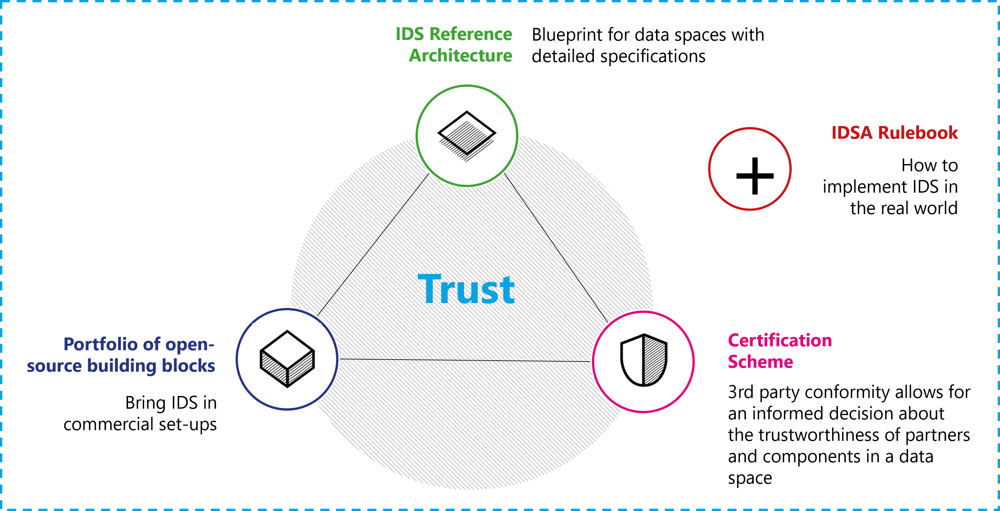

# Technical agreements

This section of the Rulebook describes the technical arrangements
required to implement an IDS-based data room. The IDS Rulebook specifies
what is mandatory and what is optional to implement but keep some
freedom how to realize these concepts (see also the section on the goals
of IDS in the IDS RAM).

The technical agreements of the
IDS-framework consist of the Reference Architecture Model (RAM) that
provides a technology-independent perspective and the
technology-specific specification on IDS-G. The two provide guidance to
create the required components. The certification scheme including the
certification criteria and the IDS-testbed helps validate compliance
with the RAM and the specification. This is IDSA's so-called magic
triangle, which is extended with the portfolio of open-source building
blocks, such as commercial solutions that are certified but not
mandatorily available as FOSS. The Rulebook itself provides a frame for
the magic triangle by describing the overarching concept of data spaces.

The mentioned IDSA assets have a defined release time to ensure
consistency between them. In general, an IDS asset can be released after
approval by the IDSA working groups and final approval by the technical
steering committee. To achieve reliability for industrial use of the IDS
assets, major releases that contain fundamental changes may be conducted
once per year. For more details see the table below.

| Asset | Major releases | Approving body |
| ----------------------- | ----------------------- | ----------------------- |
| IDS-RAM  | Second quarter of a year |    Working group architecture |
| IDS-G specifications  |  Fourth quarter of a year |    Working group architecture |
| Certification scheme  |  Second quarter of a year |    Working group certification |
| IDS-reference testbed  | Fourth quarter of a year |     Working group certification |
| IDSA Rulebook |  Third quarter of a year | Working group Rulebook |
  
## IDS Reference Architecture Model (RAM)

Data sharing is essential for data-driven business ecosystems, as is the
need for data sovereignty. The IDS Reference Architecture Model
(IDS-RAM) defines fundamental concepts for sovereign data sharing. The
IDS-RAM focuses on the general concepts, functions, and processes
involved in creating a secure network of trusted data. It resides at a
higher abstraction level than common architecture models of concrete
software solutions. The document provides an overview supplemented by
dedicated architecture specifications that define the individual
components of the IDS.

The model consists of five layers: The business layer specifies the
different roles that the participants can assume, and it specifies the
main activities and interactions connected with each of these roles. The
functional layer defines the functional requirements of the IDS, plus
the concrete features to be derived from them. The process layer
specifies the interactions between the different components of the IDS.
It provides a dynamic view of the RAM. The information layer defines a
conceptual model that describes both the static and the dynamic aspects
of the IDS constituents using data linkage principles. The system layer
addresses the decomposition of the logical software components,
considering aspects such as integration, configuration, deployment, and
extensibility of these components.

Across all five layers, three perspectives need to be implemented:
security, certification, and governance. The security perspective
defines the common security measures for the IDS and the concepts for
data usage control. The certification perspective describes the IDS
Certification scheme as a foundation in the IDS. The governance
perspective describes the responsibilities of roles in the IDS.

The current version of the IDS-RAM that forms the basis for this
Rulebook is [V4](https://docs.internationaldataspaces.org/ids-ram-4/).

## IDS specifications on IDS-G

IDS-G provides specifications and further documentation from IDSA to the
public. While the RAM is technology independent, the specifications on
IDS-G describe the binding of the RAM to technological concepts and
focus on documentation and specifications for IDS based solutions.
IDS-G's main branch is stable and therefore the reliable foundation
for the development and maintenance of IDS-based solutions. It is
maintained under the umbrella of the IDSA technical steering committee.

Additionally, IDS-G provides access to the IDSA open source projects.
Currently, the following open source projects are available:

- IDS information model

More open source projects will be set up by the IDSA technical steering
committee in the future.

The specifications in IDS-G distinguish between four different aspects:

- **Components**: The framework for implementing IDS components as
    derived from the business layer in the RAM and described in the
    system layer, including the use of certain technologies and
    standards.

- **Communication**: The interaction and communication of the IDS
    components requires a clear specification to achieve
    interoperability. The communication section distinguishes between
    messages and message types and the interaction sequences between the
    components and related state machines to keep the interaction
    synchronized. Based on these two aspects bindings to technologies
    are derived.

- **Information model**: The IDS information model provides
    fundamental concepts to describe data products based on the IDS core
    concepts and fundamental standards DCAT for data assets and ODRL for
    contract policies.

- **Usage control**: Usage control is a fundamental mechanism in IDS.
    This section describes the usage contracts and how they can be
    realized in IDS Connectors.

The IDS-G specifications are available via [GitHub](https://github.com/International-Data-Spaces-Association/IDS-G).

## IDS Certification

The IDS Certification is a perspective in the IDS-RAM and its approach
is described in detail in the IDS Certification scheme (general
structure, operational structure, and maintenance of the certification
criteria).

- The [certification scheme](https://github.com/International-Data-Spaces-Association/IDS-RAM_4_0/tree/main/documentation/4_Perspectives_of_the_Reference_Architecture_Model/4_2_Certification_Perspective/CertificationScheme) describes the operational model and
    roles in the IDS Certification.

- The [rules of procedure](https://github.com/International-Data-Spaces-Association/IDS-RAM_4_0/tree/main/documentation/4_Perspectives_of_the_Reference_Architecture_Model/4_2_Certification_Perspective/RulesOfProcedure) include the formal outline of
    organizational processes

- [Approval of evaluators](https://github.com/International-Data-Spaces-Association/IDS-RAM_4_0/tree/main/documentation/4_Perspectives_of_the_Reference_Architecture_Model/4_2_Certification_Perspective/ApprovalScheme)

- Execution of evaluations

- The [certification criteria](https://internationaldataspaces.org/publications/white-papers/) list the formal aspects of
    evaluations for the core components and the operational environment.

While the certification scheme and the documents listed above describe
the formal aspects of IDS Certifications, the IDS testbed provides the
tools and technological basis for evaluating the IDS core components.

## IDS testbed (interoperability test)

Evaluation facilities for components conduct the evaluations that ensure
a correct implementation of the IDS specifications and an adequate level
of security in the components. Ensuring a comparable quality of all
evaluations is necessary to make the certification reliable with its
different security and assurance levels.

This includes:

- All evaluation facilities conduct transparent conformance tests in
    the [„IDS reference testbed"](https://github.com/International-Data-Spaces-Association/IDS-testbed) based on the regulations from the
    certification working group and approved by the IDSA technical
    steering committee.

- All evaluation facilities assess compliance with the security
    requirements listed in the IDS criteria catalog based on tests
    derived from the criteria. Tests that can be conducted automatically
    are part of the [test suite](https://github.com/International-Data-Spaces-Association/IDS-testbed/tree/master/Testsuite) of the IDS-testbed.

- The evaluation facilities issue a certificate when conformance and
    security tests are passed.

- To ensure that the evaluation facilities conduct the evaluations
    according to the specifications, the certification body must assess
    their competence.

Ensuring interoperability between the components is one important aspect
of the evaluation and covered by the test suite provided.
