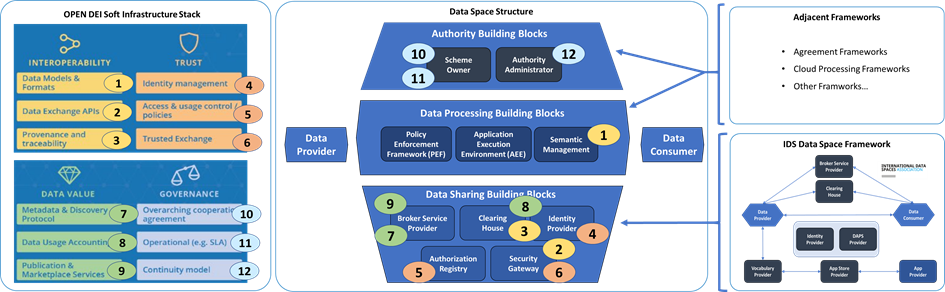
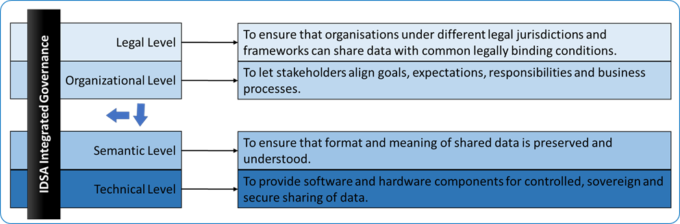

# Organizational agreements

## Certification

Trust is *the* essential element in data spaces to overcome the
reluctance to share data for fear of misuse and security concerns.

Functional requirements are an element of trust and are investigated
from the functional perspective, clarifying responsibilities and
mechanisms in Chapter 3. This chapter discusses the operational
implications using IDS Certification as an example.

Chapter 3 mentions two important aspects: The first is the data space
authority (DSA), which ensures trust in a data space. The second is the
system enabling it, the attribute-based trust mechanism, which is based
on the fundamental concepts of trust anchor and trust framework. The
first term refers to the entity that issues certifications about an
attribute, the second to the rules imposed by the trust anchor to comply
with its policies in order to be eligible for its attribute
verification. Deciding which trust anchors and trust frameworks and,
therefore which rules and procedures to use for issuing and validating
attributes, is the task of the data space authority.

Based on the trust framework(s) selected, each data space specifies the
minimum set of attributes that a participant must meet to be considered
a trusted party (see also the data space self-description mentioned in
Chapter 3). Based on this, each new potential member has to provide
these attributes in its participant self-description to be accepted.

The DSSD must also contain clear information on which trust anchors and
trust frameworks are acceptable as roots of trust within the data space,
so a potential participant can decide whether to trust the data space
and its members.

### The example of IDS Certification

For the scenario described above, the IDS Certification Scheme developed
by the IDSA is one available trust framework.

The trust anchor of this framework is called certification body and is a
neutral party issuing certification for specific attributes. The
responsibility for the certification body is taken on by a part of the
IDSA head office and by additional experts hired specifically for this
purpose. There are two attributes in the IDS Certification trust
framework: component certification and operational environment
certification.

Component certification concerns all components described in the
IDS-RAM, both essential and non-essential, and ensures their required
functionality and security. Operational environment certification refers
to the trustworthiness of the physical environment in which the
components run, as well as the processes and organizational rules there.

Both types of certifications have different options to meet the data
sharing needs of companies. These options refer to the trust levels,
which reflect the extent of functionalities and requirements covered,
and to the assurance levels, which refers to the method to evaluate
compliance. The simplest assurance levels are based on a self-assessment
mechanism, while the more advanced assurance levels require a
third-party assessment of components or operational environments. This
third-party compliance check is performed by the evaluation facilities,
which are specifically approved to offer this service. The approval
process is defined by the IDSA certification working group.

All the details on the IDS Certification scheme, the trust and assurance
levels for component certification and operational certification, the
certification criteria, and the process to approve the evaluation
facilities are provided in Chapter 2.

## Running data space instances 

### Intra- and inter data space instance governance 

It must be recognized that the role of IDS and IDSA is to fulfill (1)
within the broader landscape of existing data sharing initiatives and
(2) the ambition of a federation of interoperable data spaces. This
implies that IDSA considers its development and deployment initiatives
in the broader context of these two areas:

The striving for interoperability within a data space (intra) so that
IDS can provide a gradual migration path within a data space instance or
data sharing initiative and preparing for interoperability between
multiple data space instances or data sharing initiatives (inter) to
pave the way for the federation of interoperable data spaces - as
pursued by the European data strategy.

The Data Governance Act \[2\] also recommends both an intra data space
(domain) governance authority and an inter data space (central)
governance authority. As cited from \[6\],

'The recently proposed Data Governance Act \[2\] confirms the notion of
a governance structure constituted by multiple entities. For European
data spaces, it is recommended to have a (domain) governance authority
for each data space and a central governance authority overseeing all
aspects in connection with interoperability of data spaces, i.e., the
de-facto 'soft infrastructure'. This central authority will interact
with all data space specific authorities.'

As noted above, IDSA and the main IDS-stakeholders play an important
role by working together to ensure the development and deployment of
data space instances in the broader context of introducing new or
migrating/ developing existing data sharing initiatives, (intra data
space interoperability), and embedding them in the European ambition of
a federation of interoperable data spaces (inter data space
interoperability).

{width="6.114584426946632in"
height="1.8853291776027996in"}

[]{#_Toc126649322 .anchor}Figure 20 Relationship of OpenDEI Building
Blocks and data space instances

This structure of a data space reflects the role of the IDS data space
framework in relation to the broadly used data sharing agreement
framework that is emerging as the cloud processing framework, as shown
on the right in Figure 1:

An approach to systematically address the interoperability challenges is
provided by the new European interoperability framework developed by the
European Commission \[8\] and shown in Figure 21.

{width="6.455695538057743in"
height="2.125in"}

[]{#_Ref126648124 .anchor}Figure 21 Layered functional model as aligned
with the New European Interoperability Framework \[8\].

As Figure 21 shows, the framework distinguishes four functional levels
under an overarching integrated governance approach:

-   *Technical level,* to provide software and hardware components for
    controlled, sovereign and secure sharing of data.

-   *Semantic level,* to ensure that format and meaning of shared data
    is preserved and understood.

-   *Organizational level,* to let stakeholders align goals,
    expectations, responsibilities, and business processes.

-   *Legal level,* to make sure that organizations under different legal
    jurisdictions and frameworks can share data with common legally
    binding conditions.

Governance on the identified topics distinguishes between two
development lines for data space instances:

-   *Intra data space interoperability,* between the data space
    authority, processing, and data sharing building blocks within a
    single data space instance.

-   *Inter data space interoperability,* between multiple data space
    instances at each of the functional levels as distinguished in the
    framework shown in Figure 2.

To enable interoperability between data spaces, each of the functional
levels shown in Figure 2 contains topics that require adequate
governance. For each of the levels, these topics are identified in the
following paragraphs. Their governance aspects are addressed in the next
chapter.

### Technical level

The technical level covers the software and hardware components for
controlled, sovereign and secure sharing of data. It consists of five
sublevels with the topics that require adequate governance:

### Governance instruments

The various governance instruments that may be considered by the IDSA
are listed in the Table below. These governance tools each describe a
different aspect of a certain activity and are used in the next section
to provide a multidimensional overview of the intra and inter data
spaces governance.

+-------------+--------------------------------------------------------+
| **Table 2:  |                                                        |
| IDSA        |                                                        |
| governance  |                                                        |
| in          |                                                        |
| struments** |                                                        |
+=============+========================================================+
| **G         | **Governance instrument description**                  |
| overnance** |                                                        |
|             |                                                        |
| **i         |                                                        |
| nstrument** |                                                        |
+-------------+--------------------------------------------------------+
| *Stand      | Ensuring that the tasks, processes, and guidelines     |
| ardization* | around this activity are formalized, documented, and   |
|             | aligned between data spaces instances and the IDSA.    |
|             | The standardization efforts can generally be used as a |
|             | blueprint or starting point for the stakeholders.      |
+-------------+--------------------------------------------------------+
| *Cer        | Validating that stakeholders act according to the      |
| tification* | standardized way of working. Certification is divided  |
|             | into component certification (certification of         |
|             | technical/software components) and organizational      |
|             | certification (organizational and legal processes).    |
+-------------+--------------------------------------------------------+
| *D          | The activity may require (software) development tasks  |
| evelopment* | as part of the realization, which should be compliant  |
|             | with the standardization activities and best followed  |
|             | by a certification.                                    |
+-------------+--------------------------------------------------------+
| *           | The operations are about the exploitation and usage of |
| Operations* | the developed components. The operations can be        |
|             | certified as part of the organizational certification. |
+-------------+--------------------------------------------------------+
| *Com        | The dissemination of the activity is an important      |
| munication* | aspect which might include the awareness of the        |
|             | standardization and certification, but also contains   |
|             | marketing aspects.                                     |
+-------------+--------------------------------------------------------+
| *Support*   | The support activities include the structured          |
|             | assistance from stakeholders involved in the           |
|             | operation, development, certification, and             |
|             | communication activities.                              |
+-------------+--------------------------------------------------------+

### Governance for inter data space interoperability

There will be no single data space. Individual sectors or communities
are expected to develop their own data space instances. Being able to
seamlessly share data over these data space instances brings clear
benefits. It extends the reach and scope of accessible data and allows
the development of new business models and services across sectors and
regions. Interoperability between data space instances adds major value,
resulting in a federation of interoperable data spaces as shown on the
right of Figure 3.

#### Interoperability architecture considerations

##### Harmonization 

The Data Sharing Coalition is an open and growing international
initiative in which, a large variety of organizations are collaborating
to drive cross-domain data sharing at scale. Its results on cross-domain
data sharing were recently published in the "Data Sharing Canvas" \[7\].

The Data Sharing Canvas compared various harmonization options. Full
harmonization of data spaces, in which existing data spaces adjust their
implementations to follow a common cross data space design, is the ideal
solution to achieve multilateral interoperability. However, it impacts
all data space participants, requiring significant investments and will
therefore not be adopted. Bilateral harmonization of data spaces, in
which individual data spaces organize custom interoperability
bilaterally depend on individual participants implementing specific
harmonized solutions and will therefore limit large scale data sharing
across data spaces. As an alternative partial harmonization, which
introduces the new role "data space proxy", overcomes these limitations
of full and bilateral harmonization. The proxy absorbs the complexity of
harmonization for data spaces and its participants as much as possible
by implementing all harmonization requirements. This enables a data
provider in one data space to share data with a data consumer in another
data space, while limiting the impact on existing data providers and
data consumers.

The main function of the proxies is to translate data space specific
transactions to their harmonized equivalents:

-   Proxies translate data space specific language into a harmonized
    language in the harmonization domain to enable multilateral
    end-to-end interoperability,

-   Proxies facilitate trust across data spaces by conforming to the
    rules and agreements of the trust framework,

-   Proxies enable the discovery of data providers across data spaces.

The proxies implemented by all data spaces form a network, the
harmonization domain, which enables each data space to share data
effortlessly with other data spaces.

##### Interaction topologies

To ensure interoperability between data space instances, the
intermediary roles of these will have to interact and to exchange
(meta)data. These interactions may be designed through various metadata
role interaction topologies (MRIT). The decision to implement a specific
type of MRIT results in a governance role for the IDSA and other IDS
stakeholders in their development or deployment. They are shown in
Figure 6.

There are two basic types of MRITs applicable for exchanging (meta)data
between intermediary roles from different data space instances, as shown
in the figure:

-   *Intermediary-to-Intermediary MRIT (I2I-MRIT),* where the exchange
    of (meta)data between the intermediary roles is done on a bilateral,
    peer-to-peer basis.

An example is the broker service provider that bilaterally exchange
(meta)data on available data sources.

-   *Bridged MRIT (B-MRIT),* where the exchange of (meta)data between
    the intermediary roles uses an overarching bridging function.

An example of this is the legal framework with associated participant
registry for managing these data spaces instances and their
participants, which legally adhere to an overarching legal framework.

Different interaction topologies may be best suited for the
interoperability of the various data space capabilities, requiring a
different governance role for IDSA in developing or deploying these
topologies.

#### Concluding on the intra data space development

The exact relationship between data spaces and the IDSA may vary, but
generally the IDSA can provide guidelines, frameworks, or policies for
structuring processes within a data space instance. The data space
itself is responsible for executing this process.

A complete set of APIs for interacting with the various building blocks
and capabilities of the data space structure (as shown in Figure 1)
should be identified and defined. This will be done under the
responsibility of the IDSA technical steering committee (IDSA-TSC) and
reported on within the future releases of the IDSA Rule Book \[11\].
This may go beyond the current scope of APIs defined by the IDSA.
Specific attention should be given to:

-   An API for the policy execution framework (PEF) to be used by data
    apps for using the PEF's data control and sovereignty features, as
    identified for the application execution environment (AEE) in Table
    4.

-   APIs for managing and accessing data space membership identities (as
    provided by the DAPS and ParIS functions) to be used in the
    authorization flows for individual data transactions, as identified
    for the data space membership (DAPS, ParIS) in Table 4.

-   An API for accessing (cloud) processing capabilities for locally
    executing data apps, as identified for cloud integration (GAIA-X) in
    Table 4.

An adequate and future-proof governance process for managing the IDSA
standards is needed. The IDSA standards need management and maintenance,
including further development with backward compatibility of versions.
This process will be further explained in the future versions of the
IDSA rulebook \[11\].

#### Concluding on the inter data space development

The Data Sharing Coalition \[7\] suggests the proxy model in combination
with a harmonization domain and protocols as the architecture to enable
interoperability between data space instances for inter data space
interoperability, as shown in Figure 5. As the need for inter data space
interoperability is rapidly growing, the IDSA must assess how the
development of (IDS-based) data spaces and the role of IDSA in
co-developing the data space proxy interfaces and harmonization
protocols are impacted. The IDSA governance model of the inter data
space architectures and standards needs to be defined.

An overarching data space scheme defining and implementing joint legal
and operational agreements between adhering data spaces instances is
central to achieve this interoperability. It provides a legal framework
individual data space instances (and their subscribers) agree to adhere
to.

The role of IDSA as the overarching data space scheme owner should be
assessed and adequate governance be provided. The IDSA may perform an
ongoing operational task in fulfilling this role.

The need for inter data space interoperability has been identified as
relevant for various European research and development initiatives. For
instance, the Data Sharing Coalition \[7\] and the OPEN DEI initiative
(in the future releases of their 'Design Principles for Data Spaces'
\[6\]) are expected to explicitly address this topic. An active role of
IDSA and its stakeholders should be pursued in these European
initiatives.

### General approach

Interoperability within and across AI data spaces: Development lines of
AI data spaces provide the building blocks for managing trust, data
sovereignty and agreements to share data and algorithms - to execute AI
algorithms and data apps. Given the European ambition to federate
European data spaces, both single and multiple data spaces require
adequate governance to realize interoperability within and across data
spaces. Therefore, a distinction is made between two development lines
for data spaces:

• Intra data space interoperability, between the various building blocks
within an individual AI data space instance. The definition of
federation ("A change from one central data powerhouse to
democratization of data" NLAIC) indicates that individual AI data space
instances have a high degree of autonomy for their own internal
agreements and ICT landscape. Intra data space interoperability provides
a reference architecture based on common building blocks and path for
developing AI data space instances in an efficient and aligned manner,
providing a rich set of features to support AI challenges and
requirements. It leaves individual data spaces the option to deviate
internally from the reference architecture.

• Inter data space interoperability, between multiple data space
instances. Interoperability between AI data space instances is key for
the federation of AI data spaces to seamlessly interconnect. This is the
goal of the NLAIC data sharing working group in realizing a
cross-sectoral data sharing infrastructure for AI and aligns with the EU
data strategy. Inter data space interoperability requires prescriptive
guidelines for individual data space instances to ensure
interoperability between them.

### Conclusions

The now completed European OPEN DEI project (let by the European
Commission) aimed at defining the building blocks and standards for data
spaces, to realize interoperability between the building blocks within
specific data space instances (intra data space interoperability) and
between various data space instances (inter data space
interoperability).

The important role of IDSA and the IDS-stakeholders is to provide the
governance for data space instances in the broader context of:

> -the introduction of new or migration/ evolution of existing data
> sharing initiatives, intra data space interoperability
>
> -the embedding within the European ambition of a federation of
> interoperable data spaces and inter data space interoperability.
